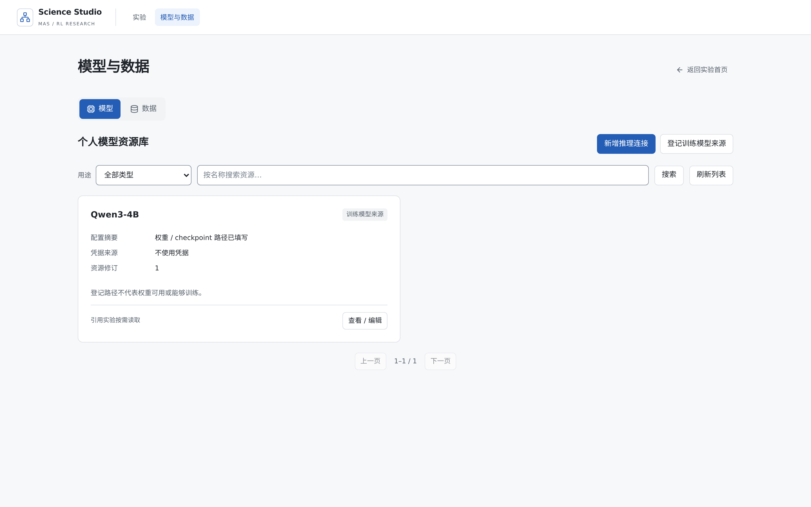
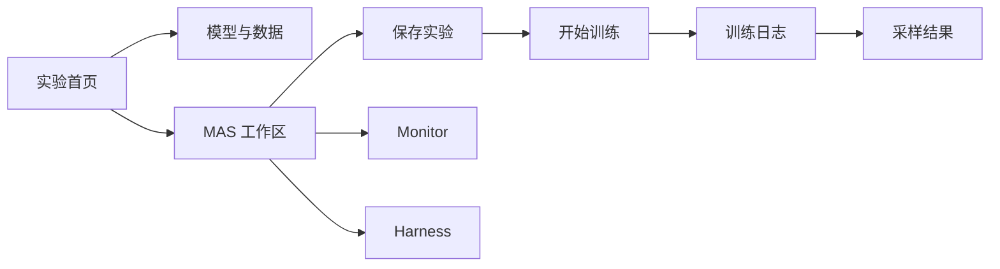
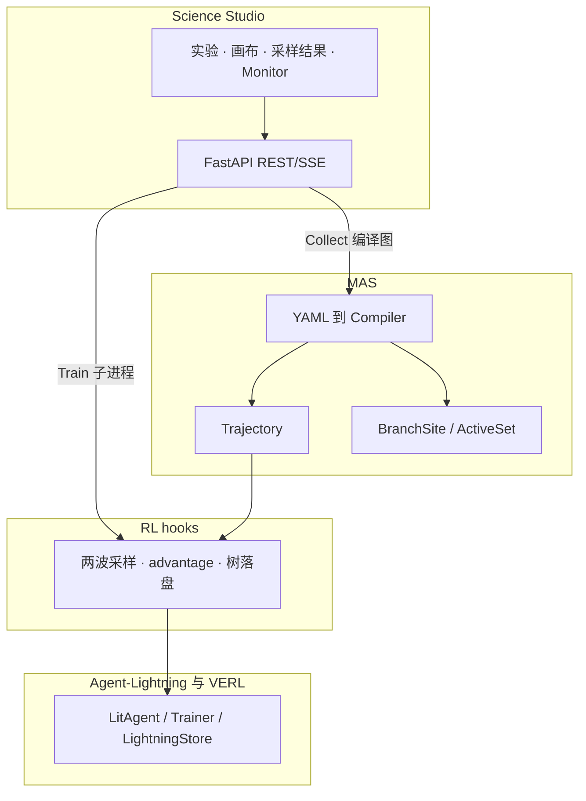

# Science Studio

Science Studio 是多智能体强化学习实验的控制面。一个实验是 `experiments/<id>/` 下的五份 YAML（experiment / llm / workflow / rl / harness），界面和命令行读写同一份文件。画布编辑 Agent 工作流和分支采样站点，不生成 LangGraph 代码。

采样站点用 `BranchSite` 声明锚点、门控和 fork 预算，写入 `workflow.yaml`。训练算法是 GRPO 族：grpo / arpo / aepo / appo / rae。第一波独立采样，第二波从断点续写并补齐到 `group_n`。训练进行时，Runs 里可以打开采样树，Monitor 显示实验级 reward 曲线和当前 run 的 stdout。采集可以单独运行，不启动训练、不占用训练 GPU。

训练运行时使用 [Agent-Lightning](https://github.com/qihoo360/agent-lightning) 与 VERL。本仓库不修改 `agent-lightning/` 的源码。Collect 走编译后的多 Agent 图；当前训练热路径仍是单 hub TirAgent，加上画布上声明的分支采样。

更新日期：2026-09-29。

## 界面

首页列出实验。模型与数据是独立页。进入实验后，顶栏是返回、实验名、GPU、保存实验、开始训练。已有活动训练时，这个按钮变成「查看训练」。

工作区菜单：Experiment、LLM、MAS、RL、Harness、Monitor、Runs。LLM、RL、Harness 是画布上的设置区，和 MAS 共用同一份未保存草稿。切菜单不会丢掉草稿；换实验才会用磁盘上的 YAML 覆盖。保存动作是顶栏的「保存实验」。

下面的截图来自本机正在运行的 Science Studio（实验 `arpo_e2e`）。

实验首页。


模型与数据。推理连接和训练权重在这里登记，密钥写入 `.secrets.env`，不回显。



工作区。左侧是模型、数据和训练策略，画布上是 Agent 与工具。Branch Site 写在对应工具节点上。


Runs 中一次已完成 ARPO 运行的采样结果。右侧是该题的执行树，分支来自 `after_tool` 站点。


Monitor。reward 曲线按实验聚合；训练日志绑定当前 run。下面这张图里没有活动训练，所以日志区为空，曲线来自已结束的训练。


训练记录。每条 run 可以打开采样结果、本次配置或日志。


训练控制台，显示该 run 的 stdout。


工作区菜单：

| 菜单 | 内容 |
|------|------|
| Experiment | 实验名、seed |
| LLM | 推理连接：API、本地 vLLM，或训练注入的 endpoint |
| MAS | Agent 图，采样模式、`group_n`、`beam_size` 和分支站点 |
| RL | 算法、每题条数、数据、训练策略、GPU 档位 |
| Harness | 诊断插件 |
| Monitor | 实验级 reward 曲线，以及当前 run 的 stdout |
| Runs | 训练记录。采样结果从这里进入 |



## 怎么跑通一次实验

界面和命令行读写同一份 YAML。Collect 走编译后的多 Agent 图。当前训练热路径是单 hub TirAgent，加上 workflow 里声明的分支采样。

### 在界面里

```bash
bash scripts/setup_uv_env.sh   # 首次
./run.sh ui --daemon           # http://127.0.0.1:8787/
```

1. 首页打开实验（例如 `arpo_e2e`），或新建一个。
2. 「模型与数据」里绑定推理模型和训练集。训练权重在 RL 设置的 `model_path`。
3. 打开 MAS：mode=`arpo`，`group_n=4`，`beam_size=2`，启用 `after_agent_turn` 和 `after_tool` 两个站点。
4. 打开 RL 设置：algo=`arpo`，每题采样条数=`4`，profile 按机器选择（单卡用 `fast`）。
5. 顶栏勾上 GPU，点「保存实验」，再点「开始训练」。
6. 「查看训练」看当前 run 的 stdout。Runs 里点「采样结果」看树是否在长。Monitor 看实验级 reward，日志区只显示这一次 run。

完整点击说明和验收表：[docs/UI_USER_MANUAL.md](docs/UI_USER_MANUAL.md)。

公网入口固定在 6006 时，用仓库里的转发器把 6006 转到容器 8787（SSE 会透传）：

```bash
nohup python3 scripts/ui_public_forwarder.py --listen 6006 --target 127.0.0.1:8787 \
  > artifacts/ui_forwarder.log 2>&1 &
```

请用外部浏览器打开。IDE 内嵌 webview 对同一域名大约只有 6 条 HTTP/1.1 连接，SSE 容易把其余请求堵住。

### 在命令行里

```bash
science-infra doctor
science-infra collect --mock --n 2 --out /tmp/traj.json   # 不占训练 GPU
science-infra diagnose /tmp/traj.json
science-infra status /tmp/traj.json --html /tmp/status.html
./run.sh train fast --algo arpo --rl-yaml experiments/arpo_e2e/rl.yaml
```

`./run.sh ui` 就是 `science-infra serve`。mock 采集走编译图；上面的 `train` 走单 hub 训练热路径。

## 架构



分层说明：[docs/TECHNICAL_FRAMEWORK.md](docs/TECHNICAL_FRAMEWORK.md)。

## 快速开始

| 依赖 | 说明 |
|------|------|
| GPU + `nvidia-smi` | 只在训练时需要 |
| Python 3.11 + [uv](https://docs.astral.sh/uv/) | 仓库 `.venv` |
| Node.js + npm | 构建 `webui/dist` |
| `data/{train,val}.parquet` | 仓库内是 5 行 GSM8K 小样本；全量在 `data/*.full.parquet.bak` |
| `LLM/Qwen3-4B` | 本地推理与训练 `model_path` |
| `.env`（可选） | `OPENAI_API_KEY` / `OPENAI_API_BASE` / `OPENAI_MODEL`，给 live Collect 用 |

```bash
bash scripts/setup_uv_env.sh
./run.sh ui --daemon
# http://127.0.0.1:8787/    API 文档 /docs
```

### `run.sh`

| 命令 | 作用 |
|------|------|
| `./run.sh smoke` | 无 GPU：doctor、依赖红线、mock 采集、diagnose、dashboard |
| `./run.sh live-api` / `live-api-data` | API LLM 单题，或从 parquet 抽题 |
| `./run.sh live-vllm` | 本地 vLLM：工具调用、答案、reward |
| `./run.sh ui [--daemon\|--stop\|--rebuild]` | 启停 Science Studio |
| `./run.sh train [fast] --algo arpo --rl-yaml experiments/arpo_e2e/rl.yaml` | 命令行训练 |
| `./run.sh feature-test [--list\|<域>\|--all]` | 功能域测试。全量数字以 `--list` 为准 |
| `./run.sh branch-ui-test [--train]` | 采样站点持久化；`--train` 再扫 expansion |
| `./run.sh arpo-train-test` | ARPO 端到端验收（需要 GPU） |
| `./run.sh traj-test` | 前端轨迹 vitest |

`functional` 域 19 例已通过（工作流、工具、Harness、RL、界面运行态）。不要把历史的「15 域 154 例」当成当前全量。

## 项目结构

```text
├── science_infra/       # FastAPI、SSE、CLI、实验 bundle
├── webui/               # Science Studio（React + React Flow）
├── mas/                 # 工作流合同、Compiler、TirAgent、ActiveSet、Harness
│   ├── tir_agent.py     # LangGraph ReAct
│   ├── train_tir_agent.py  # 唯一 import Agent-Lightning 的 MAS 入口
│   └── tests/
├── rl/                  # reward、TrainSignal、Daemon / advantage hooks
├── experiments/         # <id>/{experiment,llm,workflow,rl,harness}.yaml
├── scripts/
├── data/                # GSM8K parquet（当前为小样本）
├── LLM/
├── agent-lightning/     # 训练运行时，黑盒 submodule
├── run.sh
└── docs/
```

## 测试

```bash
./run.sh feature-test --list
./run.sh feature-test functional
./run.sh smoke
```

| 验收 | 覆盖 |
|------|------|
| `./run.sh arpo-train-test` | ARPO：启动、metrics、树落盘。2026-09-20 的 5 样本 run `384d1927458a`：`branch_local=6`，6 棵树，单 step 约 237s |
| `scripts/rollout_tree_verify.py` | 树契约、API、节点徽标 |
| `./run.sh branch-ui-test` | 站点写回 workflow；`--train` 扫 expansion |

## 文档

| 文档 | 内容 |
|------|------|
| [docs/UI_USER_MANUAL.md](docs/UI_USER_MANUAL.md) | 界面操作、参数、ARPO 点击路径、FAQ |
| [docs/TECHNICAL_FRAMEWORK.md](docs/TECHNICAL_FRAMEWORK.md) | 代码框架、合同、已知差距 |
| [docs/CONTROL_UI.md](docs/CONTROL_UI.md) | Control API |
| [docs/ARPO_TRAIN_TEST.md](docs/ARPO_TRAIN_TEST.md) | ARPO 验收 |
| [docs/ROLLOUT_SAMPLING.md](docs/ROLLOUT_SAMPLING.md) | 采样语义 |
| [docs/SAMPLING_ARPO_APPO.md](docs/SAMPLING_ARPO_APPO.md) | 与 ARPO / APPO 机制的对照 |
| [docs/BRANCH_SITE_DESIGN.md](docs/BRANCH_SITE_DESIGN.md) | BranchSite 与 RAE |
| [design.md](design.md) | 产品原则：层可独立、合同优先、插件化 |

## 开发约定

`mas/scripts/check_workflow_deps.py` 守住这些边界：

1. `mas/workflow` 不 import Agent-Lightning。AGL 只出现在 `mas/train_tir_agent.py`。
2. 画布只产 YAML。
3. 不改 `agent-lightning/` 源码。
4. rollout / resume / enqueue 的协议字段保留：`role`、`resume_boundary`、`verdict_list`。

改前端可以开两个终端：一个 `science-infra serve --port 8787`，一个 `cd webui && npm run dev`。改 Python 后要重启 UI：`./run.sh ui --stop && ./run.sh ui --daemon`。

## 致谢

训练运行时建立在这些工作之上。本仓库把它们当作黑盒或对照，不把上游实现复制进产品代码。

- [Agent-Lightning](https://github.com/qihoo360/agent-lightning) 提供 LitAgent、Trainer 和 LightningStore。本仓库的 rollout、reward 发射和训练循环接在这套运行时上。
- [VERL](https://github.com/volcengine/verl) 提供 GRPO 参数更新。算法 overlay 保持 `adv_estimator=grpo`，ARPO / AEPO / RAE 的差异在采样和 advantage 钩子里。
- [LangGraph](https://github.com/langchain-ai/langgraph) 提供 ReAct 执行图：模型、工具、收口。
- ARPO、AEPO 一类分支采样工作给出了「先独立采样、再从高熵位置续写」的问题定义。本仓库用 `BranchSite` 把站点、门控和 fork 预算声明出来，并在 Daemon 里做两波 enqueue。机制对照见 [docs/SAMPLING_ARPO_APPO.md](docs/SAMPLING_ARPO_APPO.md)。

## 常见问题

- 采集成功但没有分支树。Collect 不产生训练分支。真分支只在 `tir_algo` 为 arpo、aepo 或 rae 的训练里。到 Runs 的采样结果看。
- `branch_local_count` 一直是 0。2026-09-20 起，expand 字段会在 Daemon 快照任务之前注入。拉最新代码并重启 UI。
- 训练结束后 Monitor 曲线空了。实验级曲线会回落到 `mas/checkpoints/AgentLightning/<exp>/metrics.jsonl`。当前 run 的 stdout 在训练日志里，换 run 会清空上一份。
- 采样结果一直转圈。先换外部浏览器，再用 `curl http://127.0.0.1:8787/api/mas/rollout-trees` 看 API 是否有树。

更多见 [docs/UI_USER_MANUAL.md](docs/UI_USER_MANUAL.md)。
