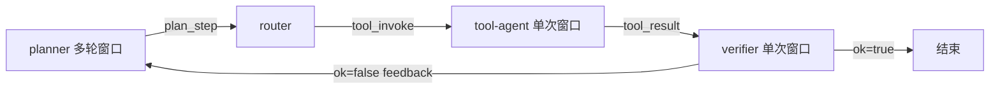
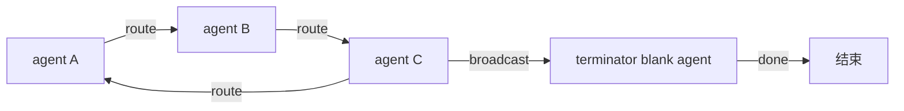

# 中心化 MAS 与 Agent 通信协议落地方案

日期：2026-09-29

本文落实 [NEW_FRAMEWORK_DESIGN.md](./NEW_FRAMEWORK_DESIGN.md) §1.2 的三个决策，但收敛 agent 种类：删除 `hub`，只保留 `planner / tool / verifier / blank` 四类 `kind`。MAS 模板固定为两种：**中心化**（有 planner 主导）与**去中心化**（无单一 plan agent）。本轮只实现中心化，去中心化给出 sketch。

通信协议是本文的核心：显式 `AgentMessage` 信封走边，MAS 层黑板日志持久化每个窗口的输入输出。比 HIVE 和 StructAgent 都更严——两者都用共享黑板或 `self.*` 当契约，没有显式消息对象；本方案给每类 agent 一个可校验的输入输出契约，空白 agent 用 JSON Schema 自描述，用户自己搭的 agent 不靠内部 prompt 解析就能接入。

依据代码：

- 声明：[mas/workflow/spec.py](../mas/workflow/spec.py)、[mas/workflow/compiler.py](../mas/workflow/compiler.py)
- 执行：[mas/workflow/runtime.py](../mas/workflow/runtime.py)、[mas/workflow/contracts.py](../mas/workflow/contracts.py)
- 工具：[mas/tools/tool_agents.py](../mas/tools/tool_agents.py)、[mas/MAS_structagent/epc_aw/](../mas/MAS_structagent/epc_aw/)
- 参考：[ref_Rep/HIVE](../ref_Rep/HIVE)、[ref_Rep/StructAgent](../ref_Rep/StructAgent)

---

## 1. 两个模板与 kind 收敛

### 1.1 删除 hub

`AgentNodeSpec.kind` 从五类收敛为四类：

```python
kind: Literal["planner", "tool", "verifier", "blank"] = "blank"
```

`topology: hub_react` 改名为 `centralized`。`MASSpec.entry_agent` 默认改为 `planner`。旧 `kind: hub` 不留别名（用户已确认 rewrite-yaml）：`_normalize_schema03` 遇到 `kind: hub` 或 `role: orchestrator` 直接报错，提示改写为 `planner`。

`HubSpec` 保留为 `planner` 的默认配置来源：`role`、`skills`、`verify`、`max_feedback_hops`、`system_prompt`。当 `agents[]` 里没有显式 planner 节点时，编译期从 `HubSpec` 合成一个 `kind: planner` 节点，id 为 `planner`。

### 1.2 两种模板

| 模板 | topology | 入口 | 本轮 |
| --- | --- | --- | --- |
| 中心化 | `centralized` | `planner` | 实现 |
| 去中心化 | `decentralized` | 无单一入口，route 边 peer-to-peer | 只 sketch |

中心化模板的数据流：



planner 是唯一的 plan agent，产出 `plan_step`。router 选一个 tool-agent。tool-agent 单次执行。verifier 判定；未通过沿 feedback 回 planner，通过且 planner 标 `done` 则结束。

### 1.3 五个 tool-agent

按决策 A，工具本身是带 LLM 的封装 agent：

| id | 来源 | 自己的 LLM 做什么 | 输入 | 输出 |
| --- | --- | --- | --- | --- |
| `wikipedia_search` | epc_aw `Wikipedia_Search_Tool` | 阅读条目抽出相关内容 | `{query}` | 分析后的摘录 |
| `google_search` | epc_aw `Google_Search_Tool` | 阅读检索结果并归纳 | `{query}` | 检索摘要 |
| `web_search` | epc_aw `Web_Search_Tool` | 阅读页面回答查询 | `{query, url}` | 页面内容分析 |
| `python_coder` | epc_aw `Python_Coder_Tool` | 把任务写成代码并执行 | `{query}` 或 `{code}` | 代码、结果、解释 |
| `think` | 新增，无外部副作用 | 对给定文本做推理 | `{text}` | 分析结论 |

`execute_python` 这个纯函数名不再作为 agent id。旧 YAML 里的 `execute_python` 在改写时映射为 `python_coder`。纯函数调用留在 agent 内部，作为执行内核，不再单独算 MAS 里的 tool。

---

## 2. 通信协议：AgentMessage 信封 + MAS 黑板日志

HIVE 和 StructAgent 都没有显式消息对象：HIVE 靠 `SystemMemory` 共享黑板 mutation + prompt 前缀注入；StructAgent 靠 `self.*` 属性。两者都能跑，但契约隐式、不可序列化、难审计、空白 agent 接入要懂内部 prompt。本方案把契约显式化。

### 2.1 AgentMessage 信封

新增 [mas/workflow/protocol.py](../mas/workflow/protocol.py)：

```python
class AgentMessage(BaseModel):
    msg_id: str = Field(default_factory=lambda: uuid4().hex)
    task_id: str
    turn: int                  # 单调递增，一次 planner→router→tool→verifier 循环 +1
    src: str                   # 发送 agent id
    dst: str                   # 接收 agent id，或 "broadcast"
    kind: Literal[
        "plan_step", "route_decision", "tool_invoke",
        "tool_result", "verify", "feedback",
        "final_answer", "error",
    ]
    payload: Dict[str, Any]
    trace_ref: Optional[str] = None   # 链到上一条 msg_id，构成因果链

    model_config = {"extra": "forbid"}
```

规则：

- 边上只传 `AgentMessage`，不传 `tool_calls` / `ToolMessage`。
- `trace_ref` 把一次完整循环串成因果链：`plan_step` → `route_decision` → `tool_invoke` → `tool_result` → `verify`，每条指向上一条的 `msg_id`。
- `turn` 由 runtime 维护，agent 自己不写。
- `dst: "broadcast"` 仅供去中心化模板的 peer-to-peer 传播；中心化模板每条消息都有确定 `dst`。

### 2.2 MAS 层黑板日志

每个窗口关闭时，runtime 统一向 MAS 层日志（`MemorySpec`，`agent: messages`）追加一条：

```python
{
    "agent_id": "python_coder",
    "turn": 3,
    "input_msg_id": "...",
    "output_msg_id": "...",
    "ok": True,
    "payload_digest": "...",   # 输出 payload 的 hash，用于去重和审计
}
```

这是 HIVE `MemoryCommitEvent` 的等价物，但写入由 runtime 统一做，agent 自己不 mutate 黑板。verifier 的 `ok=true` 且 `step_conclusion=COMPLETE` 才把 `tool_result` 的内容标记为「已提交证据」写入日志的事实区；`ok=false` 只留窗口记录，不进事实区。

agent 层 memory（决策 C）默认空。用户在 `profile.memory` 写 `{policy: append_latest, max_items: N}` 时，runtime 才用 [mas/workflow/memory.py](../mas/workflow/memory.py) 里已有的按 id 隔离缓冲。`memory_scope` 默认改为 `none`。

### 2.3 与两个参考项目的差别

| 维度 | HIVE | StructAgent | 本方案 |
| --- | --- | --- | --- |
| 通信载体 | `SystemMemory` 共享黑板 | `self.*` 属性 | `AgentMessage` 信封 |
| 契约显式度 | Pydantic schema 存在，但传递靠黑板 | 隐式，散在十余个 `self._pending_*` | 显式信封 + 每 kind payload schema |
| 审计 | `MemoryCommitEvent` 事件溯源 | 无统一审计 | 每窗口 `{in,out,ok}` 进 MAS 日志 |
| 空白 agent 接入 | 无（角色硬编码） | 无（mixin 合成） | JSON Schema 自描述，runtime 校验 |
| LLM 决定 STOP | 否（SlotGate 代码门控） | 否（ledger gate） | 否（runtime 看 planner `done` + verifier `ok`） |

---

## 3. 各 kind 的输入输出契约

每个 `AgentMessage.kind` 对应一个 payload schema。runtime 在窗口关闭时校验输出 payload；不符则 `ok: false`，沿 feedback 回上游。

### 3.1 消息种类

| kind | src → dst | payload |
| --- | --- | --- |
| `plan_step` | planner → router | `{next: str, args: Dict, sub_goal: str, done: bool}` |
| `route_decision` | router → tool-agent | `{selected: str, args: Dict, candidates: List[str], strategy: str}` |
| `tool_invoke` | router → tool-agent | tool-agent 的 `args`（见 3.3） |
| `tool_result` | tool-agent → verifier | `{output: str, ok: bool, evidence_type: str}` |
| `verify` | verifier → planner | `{ok: bool, reason: str, step_conclusion: str, slot_updates: List}` |
| `feedback` | verifier → planner | `{reason: str, attributed_to: str}` |
| `final_answer` | planner → orchestrator | `{answer: str}` |
| `error` | 任意 → orchestrator | `{agent_id: str, error: str}` |

`route_decision` 与 `tool_invoke` 在中心化模板里合并：router 选定后直接把 `args` 作为 `tool_invoke` 发给 tool-agent，`route_decision` 的字段（`selected`/`candidates`/`strategy`）写进路由器窗口的 metrics，不单独成一条消息。这样一次循环是四条消息：`plan_step` → `tool_invoke` → `tool_result` → `verify`。

### 3.2 verifier 门控三元组

沿用 HIVE 的验证门控（[ref_Rep/HIVE/MAS/hive/models/formatters.py](../ref_Rep/HIVE/MAS/hive/models/formatters.py) `ContextVerification`），收成三个字段：

| 字段 | 取值 | 含义 |
| --- | --- | --- |
| `step_conclusion` | `COMPLETE` / `INCOMPLETE` | 子目标是否完成 |
| `evidence_type` | `DIRECT` / `ABSENCE` / `ERROR` / `EMPTY` | 证据质量 |
| `slot_updates` | `List[{slot, value, filled}]` | 必填槽位填充状态 |

commit 规则（HIVE `map_verification_to_commit_kind` 的等价）：

| step_conclusion | evidence_type | slot filled | 结果 |
| --- | --- | --- | --- |
| `COMPLETE` | `DIRECT` | 是 | commit live fact |
| `COMPLETE` | `ABSENCE`/`EMPTY` | — | 降级 `REJECTED`，不写事实 |
| `INCOMPLETE` | — | — | `REJECTED`，只留窗口记录 |

LLM 不输出 STOP。终止由 runtime 判定：planner 输出 `done: true` 且 verifier `ok: true`。这是 HIVE「LLM 只产出判断与证据，终止门控由代码做」的保留。

### 3.3 tool-agent 的 args 契约

每个 tool-agent 声明自己的输入 schema，runtime 在发 `tool_invoke` 前校验：

| tool-agent | args schema | 输出 |
| --- | --- | --- |
| `wikipedia_search` | `{query: str}` | 分析后的摘录 |
| `google_search` | `{query: str}` | 检索摘要 |
| `web_search` | `{query: str, url: str}` | 页面内容分析 |
| `python_coder` | `{query: str}` 或 `{code: str}` | 代码、结果、解释 |
| `think` | `{text: str}` | 分析结论 |

`tool_result.payload`：

```python
{
    "output": str,           # 分析后的文本结果
    "ok": bool,              # 执行是否成功
    "evidence_type": str,    # DIRECT | ABSENCE | ERROR | EMPTY
    "raw_ref": Optional[str] # 指向原始检索/执行结果的存档引用
}
```

`evidence_type` 由 tool-agent 自己给初判（例如检索为空 → `EMPTY`，执行报错 → `ERROR`），verifier 可以覆盖。

### 3.4 每类 agent 的契约总表

| kind | 输入消息 | LLM | 输出消息 | 可空白化 |
| --- | --- | --- | --- | --- |
| `planner` | 题目 + 上一轮 `verify`/`feedback` | 有，多轮直到产出 `plan_step` | `plan_step` 或 `final_answer` | 否（中心化入口固定） |
| `tool` | `tool_invoke`（按 args schema） | 有，单次 | `tool_result` | 否（五个内置；用户可注册新 tool-agent，声明 args schema） |
| `verifier` | `tool_result` + 当前 `sub_goal` | 有，单次 | `verify` | 可换成空白 agent 组 + `score` 路由 |
| `blank` | 按 `profile.input_schema` 校验 | 有，单次 | 按 `profile.output_schema` 校验 | 是，用户自定义 |

---

## 4. 空白 agent 的 schema 适配

空白 agent 是用户接入自定义能力的唯一通道。它不靠内部 prompt 解析，而是用 JSON Schema 声明输入输出，runtime 校验。

### 4.1 声明

```yaml
- id: expert_phys
  kind: blank
  system_prompt: "你是物理专家。根据问题给出分析与结论。"
  profile:
    input_schema:
      type: object
      properties:
        input: {type: string}
      required: [input]
    output_schema:
      type: object
      properties:
        output: {type: string}
        confidence: {type: number}
      required: [output]
    skills: [physics]
    memory:
      policy: append_latest
      max_items: 3
```

### 4.2 运行时

1. router 选中该 blank agent，发 `tool_invoke`，payload 按 `input_schema` 校验。
2. blank agent 单次 LLM 窗口：系统提示来自 `system_prompt`，用户消息来自输入 payload。
3. LLM 输出解析为 JSON，按 `output_schema` 校验：
   - 通过 → `tool_result`，`ok: true`，`output` 取 `output` 字段。
   - 不通过 → `tool_result`，`ok: false`，`evidence_type: EMPTY`，沿 feedback 回上游。
4. `profile.memory` 非空时，该窗口的输入输出存入 agent 层私有缓冲；为空则不写。

### 4.3 默认契约

未声明 schema 时，默认 `{input: str} → {output: str}`。这让简单用例不用写 schema 也能跑，复杂用例再加约束。

### 4.4 多专家路由

多个同功能 blank agent 用 `score` 路由：

```yaml
routers:
  - id: route_judges
    candidates: [judge_a, judge_b]
    strategy: score
    scorer: judge_a
    output_contract: json
```

每个候选先完成自己的窗口输出一个分数，`scorer` 取最高。`round_robin` 按次数轮转，供训练时需要固定形状的组。

---

## 5. 中心化拓扑实现

### 5.1 数据流

一次完整循环（turn +1）：

```text
1. planner 窗口关闭，输出 plan_step{next, args, sub_goal, done}
2. router 窗口关闭，按 llm_choice 选 next ∈ candidates，输出 tool_invoke{args}
   - next 不在 candidates → router ok=false，沿 feedback 回 planner
3. tool-agent 窗口关闭，输出 tool_result{output, ok, evidence_type}
4. verifier 窗口关闭，输出 verify{ok, reason, step_conclusion, slot_updates}
   - ok=false → feedback 回 planner，reason 进下一轮 planner 输入
   - ok=true 且 planner done=true → 结束
   - ok=true 且 done=false → 下一轮，turn+1
```

每条消息带 `trace_ref` 指向上一条，构成因果链。MAS 层日志在每个窗口关闭时追加一条。

### 5.2 路由器

补 `RouterSpec.output_contract`（默认 `"json"`）。三种策略实现在新增的 [mas/workflow/router.py](../mas/workflow/router.py)：

| strategy | 行为 |
| --- | --- |
| `llm_choice` | 解析 planner 的 `plan_step.payload.next`，必须属于 `candidates`；把 `args` 转成 `tool_invoke` |
| `score` | 每个候选 blank agent 对同一输入打分，`scorer` 取最高；打分本身是各候选的单次窗口 |
| `round_robin` | 按调用计数轮转，形状固定 |

路由器是图上的节点，不是上游 agent 的工具列表。指向路由器的边写入 `route_out`。无显式路由器时，为 planner 生成隐式 `llm_choice` 路由器，候选为其 `tools` 列出的 tool-agent。

### 5.3 planner 的多轮窗口

planner 与现有 `TirAgent` 共用主循环，但：

- 不绑定工具，不发 `tool_calls`。每轮输出一个 `plan_step` JSON 或 `final_answer`。
- 系统提示来自 `system_prompt`（或 `HubSpec.system_prompt`）。
- 输入是题目 + 上一轮 verifier 的 `verify`/`feedback` payload，由 runtime 拼成用户消息。
- 停机条件：产出 `plan_step.done=true` 后等 verifier 回话；产出 `final_answer` 后直接结束。

### 5.4 verifier 的两种实现

- 默认（无 `system_prompt`）：沿用现有 `VerifierSkill`，只检查答案非空且格式通过。失败时 `route` 沿 feedback 回 planner。
- 有 `system_prompt`：一次 LLM 生成，输出按 `verify` payload schema 校验（`ok`/`reason`/`step_conclusion`/`slot_updates`）。解析失败视为 `ok: false`。

### 5.5 示例 YAML

```yaml
schema_version: "0.3"
topology: centralized
entry_agent: planner
agents:
  - id: planner
    kind: planner
    system_prompt: "把题目拆成下一步，并选出一个工具。"
    tools: [wikipedia_search, google_search, web_search, python_coder, think]
  - {id: wikipedia_search, kind: tool, trainable: true}
  - {id: google_search, kind: tool, trainable: true}
  - {id: web_search, kind: tool, trainable: true}
  - {id: python_coder, kind: tool, trainable: true}
  - {id: think, kind: tool, trainable: true}
  - id: verifier
    kind: verifier
    trainable: true
    system_prompt: "根据 tool-agent 的输出判断子目标是否完成，只输出 JSON。"
routers:
  - id: route_exec
    candidates: [wikipedia_search, google_search, web_search, python_coder, think]
    strategy: llm_choice
    output_contract: json
edges:
  - {from: planner, to: route_exec, kind: route}
  - {from: route_exec, to: verifier, kind: message}
  - {from: verifier, to: planner, kind: feedback}
```

`route_exec → verifier` 在运行时传递的是被选中 tool-agent 的 `tool_result`。verifier 的 `verify` 沿 feedback 回 planner。完成标记只由 verifier 写入，planner 不能在自己的输出里把子目标标成完成。

### 5.6 从 EPC-AW 迁什么

[mas/MAS_structagent/epc_aw/models/](../mas/MAS_structagent/epc_aw/models/) 里的 `Planner`、`Diagnoser` 保持原文件，不改内部 prompt。迁移只做适配：

- `Planner.generate_next_step` 的 `(context, sub_goal, tool_name)` 映射为 planner 窗口的 `plan_step` payload。
- `Executor` 不再作为图节点。其「生成命令并执行」拆进 tool-agent；`python_coder` 等 LLM-in-tool 继续当 `kind: tool` 的后端。
- `Diagnoser.verificate_context` 映射为 verifier 窗口的 `verify` payload。`SUBGOAL_COMPLETE` → `step_conclusion: COMPLETE`。任务级停止仍由 runtime 决定，不采用模型输出的 STOP。

`Solver.solve` 的手写循环不进入 `workflow/`。图行走就是该循环的声明式版本。

---

## 6. 去中心化拓扑 sketch

本轮不实现，只给数据流和未决问题。



- 无 planner。tool-agent 与 blank agent 经 `route` 边 peer-to-peer 传 `AgentMessage`，`dst` 可以是具体 agent 或 `broadcast`。
- 终止由一个 `terminator` blank agent（声明 `output_schema` 含 `done: bool`）或多数表决决定。
- 路由器仍可用，但候选不再由单一 planner 喂入，而是由当前 agent 的输出决定下一跳。

未决问题：

1. **终止判定**：terminator agent 的权威性如何保证？多数表决的 quorum 怎么定？
2. **组内可比性**：没有固定入口时，GRPO 组内轨迹形状发散，基线怎么算？可能需要按 `agent_path` 分桶。
3. **循环检测**：peer-to-peer 可能成环，需要 turn 上限或访问集。
4. **训练信号**：没有 planner 的多轮窗口，可训练 token 集中在各 agent 的单次窗口，credit 怎么分配？

这些留给后续设计，本文不展开。

---

## 7. 与 HIVE / StructAgent 的取与不取

| 来源 | 取 | 不取 |
| --- | --- | --- |
| HIVE | 验证门控三元组 `step_conclusion/evidence_type/slot_updates`；LLM 不决定 STOP；`MemoryCommitEvent` 事件溯源（落成 MAS 黑板日志） | 共享黑板 mutation 当唯一通信；`RolePacket` 知识溯源遥测；outline 用 JSON 字符串；因果干预阶梯 |
| StructAgent | 完成必须经证据；失败去向三类（replan/redo/override）映射到 feedback 边和路由器 | 隐式 `self.*` 当契约；mixin 主循环；GUI burst；归因规则引擎 |
| 两者共同 | 三角色 IO 契约、按角色裁剪上下文 | 手写 Solver 循环、字符串 exec 工具命令 |

失败去向只保留三类，全部用现有边，不新增角色：

| StructAgent 干预 | 本方案 |
| --- | --- |
| `planner_replan` | verifier `ok: false`，沿 feedback 回 planner |
| `actor_redo` | 路由器对同一 tool-agent 再选一次（verifier `reason` 要求重试，且未超跳数） |
| `verifier_override` | 图上再接一个 verifier；第一个的输出是第二个的输入 |
| `env_intervention` | 不实现。科学 MAS 没有桌面环境修复 |

---

## 8. 旧 YAML 改写清单

用户已确认 rewrite-yaml，不留 hub 别名。改写以下两个文件：

### 8.1 mas/specs/hub_react.yaml

```yaml
schema_version: "0.3"
topology: centralized
entry_agent: planner
hub:
  role: planner
  skills: [react_loop]
tools: [wikipedia_search, google_search, web_search, python_coder, think]
llm:
  kind: api
  model: ""
  base_url: ""
memory:
  agent: messages
  system: none
archive:
  window: post_first_tool
```

### 8.2 experiments/arpo_e2e/workflow.yaml

- `topology: hub_react` → `centralized`
- `entry_agent: hub` → `planner`
- `agents[]` 里 `id: hub, kind: hub` → `id: planner, kind: planner`
- `tools` 与 `agents[].tools` 里 `execute_python` → `python_coder`，补 `google_search`/`think`
- `edges` 里 `from: hub` → `from: planner`，`tool_call` 边改为指向隐式路由器或显式 `route_exec`
- `sampling.sites[].anchor.agent_id: hub` → `planner`，`tool_id: execute_python` → `python_coder`

改写后该实验仍能 Collect 与 Train，消息流变为四条 `AgentMessage` 一循环，不再有 `tool_calls`/`ToolMessage`。

---

## 9. 分阶段工程改动

每阶段保持可编译。顺序服从决策：先建协议，再改分派，再换工具，最后改写 YAML。

### 测试后端（本地 LLM，不调云端）

模型权重在 `/root/autodl-tmp/MAS_Science_Infra/LLM/Qwen3-4B`。MAS 的 `TirRunner` / `epc_aw` engine 走 OpenAI 兼容协议，用 **vLLM** 起本地端点：

```bash
bash scripts/serve_local_llm.sh
```

约定：

- 服务名 `Qwen3-4B`，默认 `http://localhost:8000/v1`。
- 环境变量：`OPENAI_API_BASE=http://localhost:8000/v1`、`OPENAI_MODEL=Qwen3-4B`、`OPENAI_API_KEY=EMPTY`。
- 集成测试用 `mas/tests/conftest.py` 的 `local_llm_endpoint` fixture 探测 `/v1/models`；不通则 `pytest.skip`，不回退到云端 API。

### 阶段 A — 通信协议与 kind 收敛

| 文件 | 改动 |
| --- | --- |
| 新增 [mas/workflow/protocol.py](../mas/workflow/protocol.py) | `AgentMessage` 信封；每 kind 的 payload schema；`validate_payload(kind, payload)`；`trace_ref` 因果链构造 |
| [mas/workflow/spec.py](../mas/workflow/spec.py) | `kind` 删 `hub`，加 `centralized`/`decentralized` topology；`RouterSpec.output_contract`；`memory_scope` 默认 `none`；`_normalize_schema03` 遇 `hub`/`orchestrator` 报错 |
| [mas/workflow/contracts.py](../mas/workflow/contracts.py) | `WindowEndEvent` 的 `kind` 取值收敛为 `after_agent_turn`（tool-agent、verifier、blank 都用这个） |

### 阶段 B — 编译与运行时分派

| 文件 | 改动 |
| --- | --- |
| [mas/workflow/compiler.py](../mas/workflow/compiler.py) | 指向路由器的边写入 `route_out`；无显式路由器时为 planner 生成隐式 `llm_choice` 路由器；`tool_call` 边只作候选声明；`trainable_agents()` 去掉 `KNOWN_TOOLS` 黑名单 |
| 新增 [mas/workflow/router.py](../mas/workflow/router.py) | `llm_choice` 解析 `plan_step.next` 并校验候选；`score` 调用各候选；`round_robin` 计数。返回 `selected` 与 metrics |
| [mas/workflow/runtime.py](../mas/workflow/runtime.py) | 按 `AgentMessage` 流分派：planner 多轮 → router → tool-agent 单次 → verifier 单次。每窗口关闭写 MAS 日志。删除「非 verifier 一律 TirAgent」 |

### 阶段 C — 五个 tool-agent 与三角色合流

| 文件 | 改动 |
| --- | --- |
| [mas/tools/tool_agents.py](../mas/tools/tool_agents.py) | 五个 id 都包成 agent 契约，内部调 epc_aw 工具的 `execute`；`think` 只调 LLM。声明各自 args schema。删除 `BlankAgentAdapter` 的 `blank:` 前缀 |
| [mas/MAS_structagent/epc_aw/models/planner.py](../mas/MAS_structagent/epc_aw/models/planner.py) | 外包一层：输出映射为 `plan_step` payload。内部 prompt 不动 |
| [mas/MAS_structagent/epc_aw/models/diagnoser.py](../mas/MAS_structagent/epc_aw/models/diagnoser.py) | 外包一层：输出映射为 `verify` payload |
| [mas/MAS_structagent/epc_aw/models/executor.py](../mas/MAS_structagent/epc_aw/models/executor.py) | 不再作为图节点。原调用改由路由器选中的 tool-agent 执行 |
| [mas/tir_agent.py](../mas/tir_agent.py) | planner 路径只产生 `plan_step`/`final_answer`。删除把下游调用写成 `ToolMessage` 的路径。每个 agent 窗口结束写 `WindowEndEvent`，`agent_id` 是该 agent |

### 阶段 D — 空白 agent schema 与 UI

| 文件 | 改动 |
| --- | --- |
| [mas/workflow/protocol.py](../mas/workflow/protocol.py) | `validate_against_json_schema(payload, schema)`；默认 `{input:str}->{output:str}` |
| [science_infra/control/services.py](../science_infra/control/services.py) | palette 的 `agent_templates` 只保留四种 kind；router 单独成模板 |
| [webui/src/features/mas/](../webui/src/features/mas/) | 画布节点是 agent，`kind` 为标签；router 来自 `routers[]`；空白 agent 编辑器加 `input_schema`/`output_schema` 字段 |

### 阶段 E — 旧 YAML 改写与回归

改写第 8 节两个文件。回归确认编译结果含 planner、隐式/显式路由器、五个 `kind: tool` 节点，运行时消息流为四条 `AgentMessage` 一循环。

---

## 10. 验收

### 10.1 通信协议

- 图运行中不产生 `tool_calls` 和 `ToolMessage`。agent 之间只传 `AgentMessage`。
- 每条消息带 `trace_ref`，一次循环的四条消息构成因果链。
- 每个窗口关闭后，MAS 层日志多一条 `{agent_id, turn, input_msg_id, output_msg_id, ok}`。
- verifier `ok=true` 且 `step_conclusion=COMPLETE` 才把 `tool_result` 写入日志事实区。

### 10.2 契约校验

- `plan_step.next` 不在路由器 `candidates` 内时，router 窗口 `ok=false`，不调用 tool-agent。
- tool-agent 的 `args` 不符合其声明 schema 时，`tool_invoke` 发出前被拒。
- blank agent 的 LLM 输出不符合 `output_schema` 时，`tool_result.ok=false`，沿 feedback 回上游。
- 未声明 schema 的 blank agent 走默认 `{input:str}->{output:str}`。

### 10.3 verifier 门控

- `COMPLETE + DIRECT + filled` 才 commit live fact。
- `COMPLETE + ABSENCE/EMPTY` 降级 `REJECTED`，不写事实。
- `INCOMPLETE` 只留窗口记录。
- LLM 输出不含 STOP；终止由 runtime 看 `plan_step.done` + `verify.ok`。

### 10.4 空白 agent 注册

- 用户声明 `input_schema`/`output_schema` 的 blank agent 能被 `score` 路由器选为候选并完成一次窗口。
- `profile.memory` 为空时不写私有缓冲；非空时按 `append_latest` 截断。
- `blank:` 前缀不再出现在运行时 id。

### 10.5 旧 YAML

- 改写后的 `mas/specs/hub_react.yaml` 与 `experiments/arpo_e2e/workflow.yaml` 编译成功。
- `kind: hub` 在新 YAML 中出现即报错。
- `execute_python` 映射为 `python_coder`。
- `sampling.sites[].anchor` 的 `agent_id`/`tool_id` 同步改写。

### 10.6 建议单测

- 协议：`AgentMessage` 序列化 round-trip；`trace_ref` 因果链构造；payload schema 校验通过/失败。
- 编译：旧 hub YAML 报错；中心化 YAML 的 `route_out` 含路由器；非法候选失败。
- 运行（mock LLM）：一次循环产出四条 `AgentMessage`，`agent_id` 依次为 planner、路由器、tool-agent、verifier；verifier 失败回边。
- 门控：四种 `step_conclusion`/`evidence_type` 组合的 commit 结果正确。
- 空白 agent：自定义 schema 校验；默认契约；`score` 路由取最高。
