# Science Studio 使用手册

日期：2026-09-30

本手册面向使用者，覆盖 **Science Studio**（`webui/` + `science_infra/control/`）的界面、参数，以及「跑一个典型例子：ARPO 训练」的操作步骤。界面和命令行读写同一份五层 YAML。

相关文档（本文不重复展开，需要时交叉引用）：

- [CONTROL_UI.md](./CONTROL_UI.md) — 控制面落地说明与 API 一览
- [ROLLOUT_SAMPLING.md](./ROLLOUT_SAMPLING.md) — 采样语义（独立 rollout / branch / beam_size）
- [SAMPLING_ARPO_APPO.md](./SAMPLING_ARPO_APPO.md) — 官方 ARPO/APPO 与 MAS 的机制对照
- [ARPO_TRAIN_TEST.md](./ARPO_TRAIN_TEST.md) — ARPO 训练端到端测试手册（CLI 视角）
- [BRANCH_ROLLOUT_UI_TEST.md](./BRANCH_ROLLOUT_UI_TEST.md) — Branch / RAE 验收清单（防假绿）
- [ROLLOUT_SAMPLING_UI_TEST.md](./ROLLOUT_SAMPLING_UI_TEST.md) — Rollout Sampling 小窗手测表

---

## 目录

1. [快速开始](#1-快速开始)
2. [界面总览](#2-界面总览)
3. [各模块详解](#3-各模块详解)
   - 3.1 [顶栏与全局操作](#31-顶栏与全局操作)
   - 3.2 [Experiment 页](#32-experiment-页)
   - 3.3 [LLM 页](#33-llm-页)
   - 3.4 [MAS 页（画布 + Rollout Sampling 小窗）](#34-mas-页)
   - 3.5 [RL 页](#35-rl-页)
   - 3.6 [Runs 与采样结果](#36-runs-与采样结果)
   - 3.7 [Harness 页](#37-harness-页)
   - 3.8 [Monitor 页](#38-monitor-页)
4. [参数设置教程](#4-参数设置教程)
5. [典型例子：跑一次 ARPO 训练](#5-典型例子跑一次-arpo-训练)
6. [常见问题 FAQ](#6-常见问题-faq)

---

## 1. 快速开始

### 1.1 启动 UI

总命令（仓库 uv `.venv`，不要用 miniconda）：

```bash
./run.sh ui                    # 前台启动（首次会自动 npm build webui）
./run.sh ui --port 8787 --rebuild  # 指定端口并强制重建前端
./run.sh ui --daemon           # 后台启动；日志在 artifacts/run_smoke/ui.log
./run.sh ui --stop             # 停止后台 UI
```

启动后浏览器打开 [http://127.0.0.1:8787/](http://127.0.0.1:8787/)；后端 API 文档在 `/docs`。

`./run.sh ui` 等价于：

```bash
# 由 run.sh 自动完成：
#   .venv/bin/science-infra serve --host 0.0.0.0 --port 8787
cd webui && npm install && npm run build && cd ..
```

### 1.2 前置条件

| 依赖 | 说明 | 缺失时的症状 |
|------|------|------------|
| uv `.venv` | `bash scripts/setup_uv_env.sh` 创建（Python 3.11） | `run.sh` 报「未找到 uv 虚拟环境」 |
| npm | 构建 `webui/dist` | `run.sh ui` 报「启动 UI 需要 npm」 |
| `.env` API 配置 | `OPENAI_API_KEY / OPENAI_API_BASE / OPENAI_MODEL`（live Collect 用） | Collect (live) 失败 |
| GPU + nvidia-smi | 仅训练需要 | Train 被拒；`./run.sh train` 报错 |
| `data/*.parquet` 与 `resources/datasets.yaml` | parquet 由 `mas/scripts/prepare_data.sh` 生成。目录里的 HIVE JSON 登记后也可选作训练、验证或测试集 | 训练报「缺少 parquet」；测试对话框里看不到未登记的文件 |
| 本地模型 | `LLM/Qwen3-4B`（local LLM 与 RL 训练的 `model_path`） | local 模式 / 训练失败 |

### 1.3 最小验证路径

```bash
./run.sh ui --daemon          # L0.1 起 UI
# 浏览器选实验（如 arpo_e2e）
./run.sh ui-test --no-train   # L0.3 测 GPU/RL 控制 API 活着
```

代码更新后 **必须重启 UI**（`./run.sh ui --stop && ./run.sh ui --daemon`），否则 palette 可能缺少 `rae` 等新选项、Collect 可能拒绝 `sites`。

### 1.4 AutoDL 公网访问（6006 → 8787 转发器）

AutoDL 实例的公网入口固定在 6006 端口（HTTP），而 Control UI 跑在容器内 8787。若「我的云程序」里映射到 6006 的是 JupyterLab 等其他服务，UI 就无法从公网打开。用仓库自带 TCP 转发器解决（`scripts/ui_public_forwarder.py`，纯标准库，支持 SSE 长连接透传）：

```bash
# 先在 AutoDL「我的云程序」里停掉占用 6006 的实例（如 JupyterLab）
nohup python3 scripts/ui_public_forwarder.py --listen 6006 --target 127.0.0.1:8787 \
  > artifacts/ui_forwarder.log 2>&1 &
```

之后用 AutoDL 给出的公网地址（`https://xxx.gpushare.com:6006/` 形式）直接访问 Control UI，SSE 实时事件（`rollout_tree` / 状态 chip）也能正常透传。不用时 `pkill -f ui_public_forwarder` 并把 JupyterLab 映射恢复即可。

> 浏览器请用外部浏览器（Chrome / Edge / Firefox）。IDE 内嵌 webview 对同一域名大约只有 6 条 HTTP/1.1 连接，SSE 长连接容易把其余请求堵住（见 FAQ Q12）。

---

## 2. 界面总览

Science Studio 有两个入口：首页「实验」（`#/experiments`），以及独立页「模型与数据」（`#/resources/models`、`#/resources/datasets`）。打开一个实验后进入 MAS 工作区。顶栏放实验级操作，菜单在七个工作区之间切换。LLM、RL、Harness 是画布上的设置区，和 MAS 共用同一份未保存草稿。

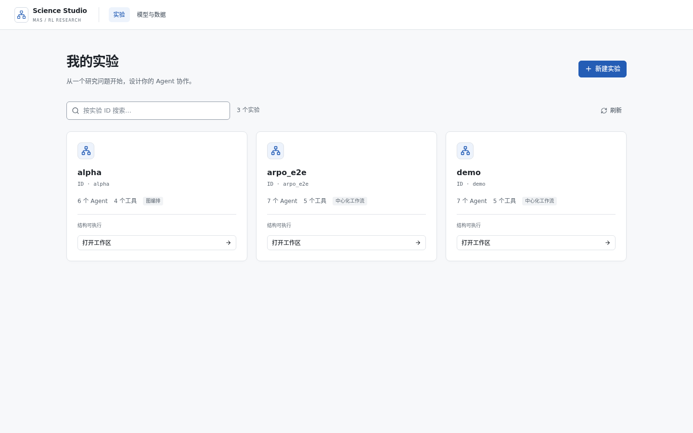

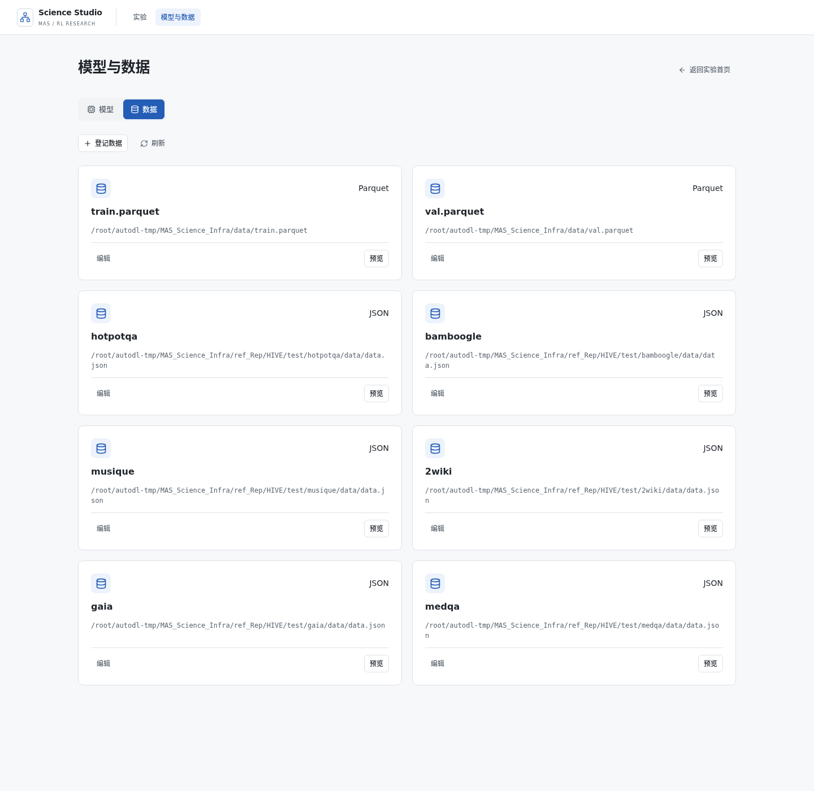

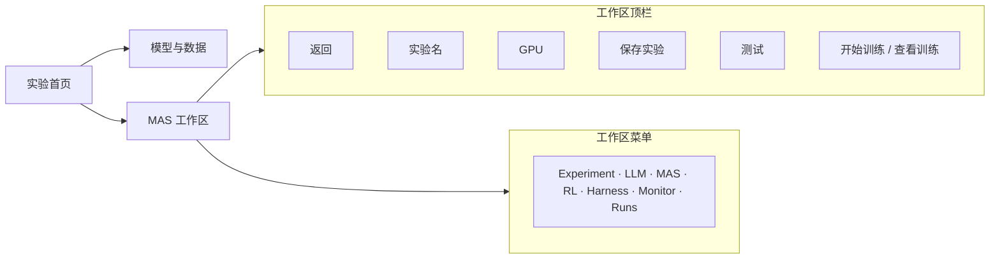

### 2.1 顶栏

| 控件 | 作用 |
|------|------|
| 返回 | 回到实验首页 |
| 实验名 | 当前实验。换实验会丢弃未保存草稿，用磁盘上的五份 YAML 覆盖 |
| GPU | 勾选训练占用的卡。保存时写入 `rl.devices.ids`，并同步 `trainer.n_gpus_per_node` |
| 保存实验 | 把 Experiment、LLM、MAS、RL、Harness 的草稿一并写入五份 YAML |
| 测试 | 从「模型与数据」里选一份已登记的数据集做推理。不调用 `/api/rl/train`。开始后进入和训练相同的控制台，日志按跳打印 `src -> dst` |
| 开始训练 | 尚无活动训练时显示。确认后停止本地 vLLM，再 `POST /api/rl/train` |
| 查看训练 | 已有活动训练时替换「开始训练」，进入训练控制台 |
| 模型与数据 | 打开资源页，绑定推理模型和数据集 |
| 菜单 | 切换下面七个工作区 |

采集和诊断不在顶栏。mock / live 采集走命令行 `science-infra collect`。对已有 `collect.json` 做诊断，在 Harness 里点「保存并诊断已有产物」，或运行 `science-infra diagnose`。

这些字段仍在 YAML 里，只是不再做成顶栏摘要：

- **入口**：`workflow.entry_agent`，在 MAS 上设采集入口。
- **可训**：planner、verifier、blank 可以勾「参与训练」。tool-agent 强制不可训练。
- **GPU**：`rl.devices.ids`，即 `CUDA_VISIBLE_DEVICES`。
- **n**：每题采样条数，GRPO 组大小，对应 `rollout.n`。
- **runners**：并行采集进程数 `n_runners`，在 RL 设置里。

### 2.2 工作区菜单

| 菜单 | 职责 | 写哪个 YAML |
|------|------|-----------|
| Experiment | 实验名、seed | `experiment.yaml` |
| LLM | 推理后端：API / 本地 vLLM / RL endpoint | `llm.yaml`（密钥进 `.secrets.env`） |
| MAS | Agent 图、Rollout Sampling 小窗 | `workflow.yaml` |
| RL | 算法、数据、训练策略、环境 | `rl.yaml` |
| Harness | 诊断插件 | `harness.yaml` |
| Monitor | 实验级 reward 曲线，和当前 run 的实时 stdout | — |
| Runs | 训练记录。每条 run 上有「采样结果」 | — |

采样树的路由是 `#/experiments/<id>/runs/<runId>/samples`。它从 Runs 或训练控制台进入，不在菜单里占一项。

### 2.3 训练进行时

顶栏按钮变成「查看训练」。控制台里是这一次 run 的状态和 stdout，可以停止训练；训练中 LightningStore 存活时可以打开 AGL Metrics。已完成的 run 不再显示停止。Monitor 的日志区绑定同一个 run：切换 run 会清空上一份，再订阅新的 SSE。实验级 reward 曲线不跟着这次切换清空。

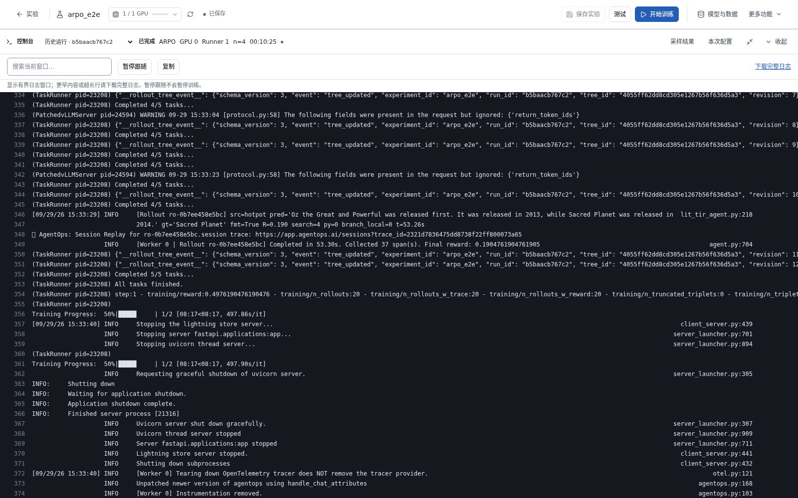

控制台标题行给出状态、算法、GPU、Runner 和 `n`。搜索只覆盖当前窗口，更早的行用「下载完整日志」。顶栏「测试」打开的是同一个窗口，但没有「停止训练」「采样结果」「本次配置」。

### 2.4 切菜单不丢草稿

LLM、MAS、RL、Harness 挂在同一块画布草稿上：

- 未点「保存实验」时，切菜单后草稿还在。
- 只有切换实验，才会用磁盘 YAML 覆盖本地草稿。
- 勾 GPU 不会把未保存的数字写回 YAML，要再点保存。
- 训练是否在跑由 `/api/rl/activity` 判断。切到别的菜单再回来，活动训练仍可从「查看训练」进入。

---

## 3. 各模块详解

### 3.1 顶栏与全局操作

元素见 [§2.1](#21-顶栏)。操作要点：

- **GPU**：点击切换选中。悬停显示显存和利用率。点「保存实验」后写入 `rl.devices.ids` 与 `trainer.n_gpus_per_node`。
- **保存实验**：五份 YAML 一起落盘。图不可执行时，保存后的状态 chip 会给出原因。
- **开始训练**：确认弹窗会说明将停止本地 LLM。后端先按 workflow 的采样声明做 overlay，再拉起 `train_tir_agent.py`。
- **查看训练**：打开当前 run 的控制台。日志是这条 run 的 SSE，不是实验级曲线。

采集不在顶栏。等价命令：

```bash
science-infra collect --mock --n 2 --out /tmp/traj.json
science-infra diagnose /tmp/traj.json
```

Collect 会走编译后的中心化图（planner → router → pool → verifier）。开始训练后的热路径仍是单 hub TirAgent，加上 workflow 里声明的分支采样。顶栏「测试」是另一次推理，不走训练。

### 3.2 Experiment 页

**功能**：管理实验（一个实验 = `experiments/<id>/` 目录，含 5 个 YAML + `artifacts/`）。

**操作**：

1. **当前实验**下拉切换（切换会用磁盘 YAML 覆盖所有面板草稿，注意先保存）。
2. 编辑 **name** / **seed** → 「保存 experiment.yaml」。
3. **新建实验**：输入新 exp id → 「创建」（默认 seed=42）。
4. 底部显示 `path=... · topology=... · executable/blocked` 状态 chip。

**字段表**：

| UI 字段 | YAML 字段 | 说明 |
|---------|----------|------|
| name | `experiment.name` | 展示名 |
| seed | `experiment.seed` | 随机种子（默认 42） |
| agl_metrics_url | — | 只读，固定同源 `/agl/metrics` |

### 3.3 LLM 页

**功能**：配置推理后端。三种模式：

| 模式 | 用途 | 可用阶段 |
|------|------|---------|
| `api` | 第三方 OpenAI 兼容 API（如 dmxapi 的 qwen3.5-27b） | Collect (live) / 诊断 |
| `local` | 一键启动本地 vLLM（占 GPU） | Collect (live)；**与训练互斥** |
| `rl_endpoint` | 训练时由 Agent-Lightning ProxyLLM 注入 | 仅训练中；Collect 阶段不可用 |

**api 模式字段**：

| 字段 | YAML | 说明 |
|------|------|------|
| model | `llm.model` | 模型名，如 `qwen3.5-27b` |
| base_url | `llm.base_url` | 如 `https://www.dmxapi.cn/v1/` |
| API Key | 写入 `.secrets.env` | 输入框 password 型，**不回显**；已配置时显示 `••••（已配置）` |

**local 模式额外字段**：

| 字段 | YAML | 默认 | 说明 |
|------|------|------|------|
| model_path | `llm.model_path` | — | 本地权重路径，如 `LLM/Qwen3-4B` |
| port | `llm.port` | 8000 | vLLM OpenAI 端口 |
| gpu_memory_utilization | `llm.gpu_memory_utilization` | 0.45 | 显存占用比例 |

**操作按钮**：

- 「保存 llm.yaml」
- 「探测连接」：POST `/api/llm/health`，返回 ok / 错误码
- local 模式额外有：「一键启动 LLM」（先保存再启动 vLLM 子进程）、「停止 LLM」

注意：训练启动会自动停止本地 vLLM（Train 与本地 LLM 抢 GPU）。

### 3.4 MAS 页

MAS 页是核心编辑区：主画布、采样设置、以及顶栏的「测试」。中心化模板画出来是 planner、router、tool-agent pool、verifier。

下图把 verifier 从和 router 重叠的位置拉开，并临时把采样模式改成 ARPO，方便看清四个节点。浏览器显示未保存，实验文件没有写入。

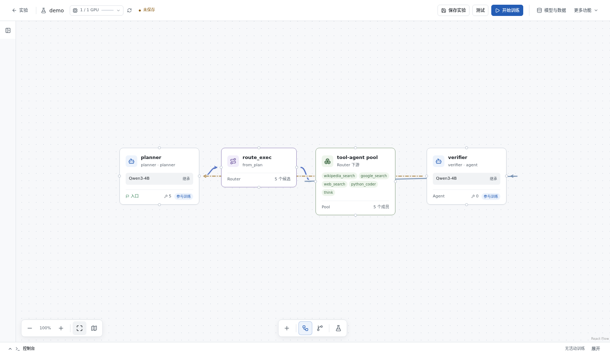

#### 3.4.1 主画布

左侧工具箱分四栏：Agent、Tool、Router、模板。

| 栏 | 放上画布之后 |
|------|------|
| Agent | planner、verifier，或自定义 blank。可以参与训练 |
| Tool | 不新建节点。点名字是把这个 tool-agent 加入当前 router 的 pool |
| Router | 新建一个 router，并自动带出一个空的 pool |
| 模板 | 用整张工作流替换画布。中心化、双 router、空白专家等都在这里 |

tool-agent 不可训练，也不单独占节点。点 pool 可以增加或删除成员。每个成员有级别：`lite` 用现在的 HTTP kernel，`pro` 再做选页和落地页摘录。缺省 lite，写入该 agent 的 `profile.tier`。`google_search` 的检索页是 Bing / DuckDuckGo，不是 Google 网页。

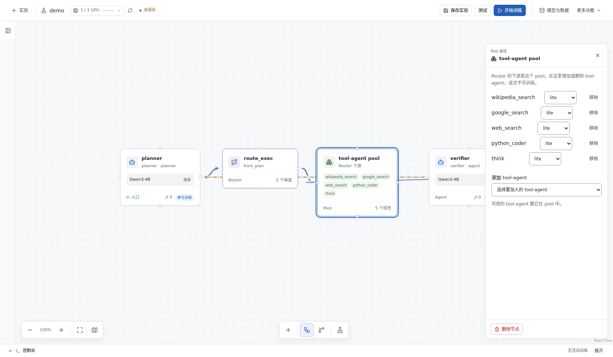

hub 和 executor 不再是可以拖进来的 Agent。`workflow.hub` 仍保留 verify 和反馈轮数。

**连线**：planner → router 是 `route`，router 在画布上先连到 pool，pool 再连到 verifier。保存时 pool 折叠掉，磁盘上是 router → verifier 的 `message`，以及 verifier → planner 的 `feedback`。每个 router 有自己的 pool。

**节点属性**：planner / verifier / blank 可以改模型、系统提示词和是否参与训练。pool 的属性是成员列表和每个成员的 lite / pro。

#### 3.4.2 采样点

采样模式、`group_n`、`beam_size` 仍在 MAS 设置里。可选位置只有：

- 每个非 tool agent 结束之后。planner 和 blank 的锚点是 `after_agent_turn`，verifier 是 `after_verifier`。
- 每个 router 结束之后，锚点也是 `after_agent_turn`，文案是「路由结束后」。

不按 tool 展开。站点默认关闭，打开后才写入 `sampling.sites`。画布上采样点挂在该节点的下一条 route、message 或 feedback 边上。中心化模板里，planner 的点在 planner → router 上。

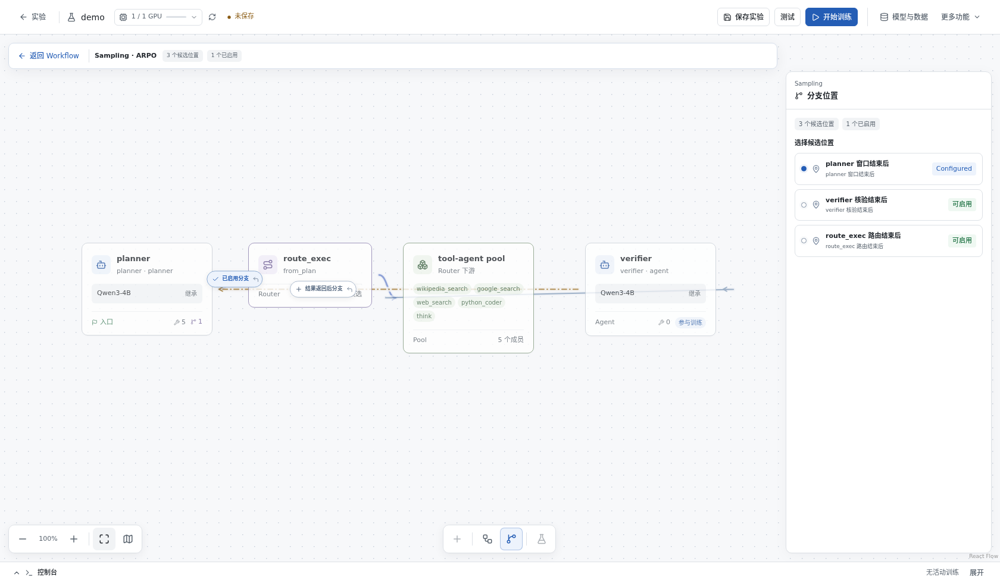

采样设置仍在 MAS 页：

| 旋钮 | 写入 | 含义 |
|------|------|------|
| mode | `sampling.mode` | `grpo_n` / `arpo` / `aepo` / `appo` / `rae` |
| group_n | `sampling.group_n` | 每题最终凑满的完整轨迹条数 |
| beam_size | `sampling.beam_size` | 从一个中间 snapshot 最多再开几条 branch |

打开一个候选后，可以设：

| 控件 | 写入 | 说明 |
|------|------|------|
| 启用 | `sites[].enabled` | 该点允许 fork |
| gate | `sites[].gate.type` | `entropy_delta`、`dual_entropy`、`always`、`tool_ok`、`tool_error`、`verifier_pass`、`verifier_fail`、`contradiction`、`failure_trigger` |
| reward | `sites[].reward.scheme` | `scalar_grpo` 或 `rae_adjudicate` |
| beam | `sites[].fork.beam_size` | 该站点分支数，默认 2 |

`anchor.kind` 里 `after_tool`、`on_token`、`after_edge` 仍能被旧 YAML 读入。2026-09-19 的 5×3 持久化回归覆盖的是当时的小窗。当前画布不再把 tool 列成候选，也不再提供「展开 tool 屏障」。

#### 3.4.3 测试 MAS

顶栏「测试」打开对话框。数据集来自「模型与数据」，可以是 parquet，也可以是已登记的 HIVE JSON。选择条数后点「开始测试」。

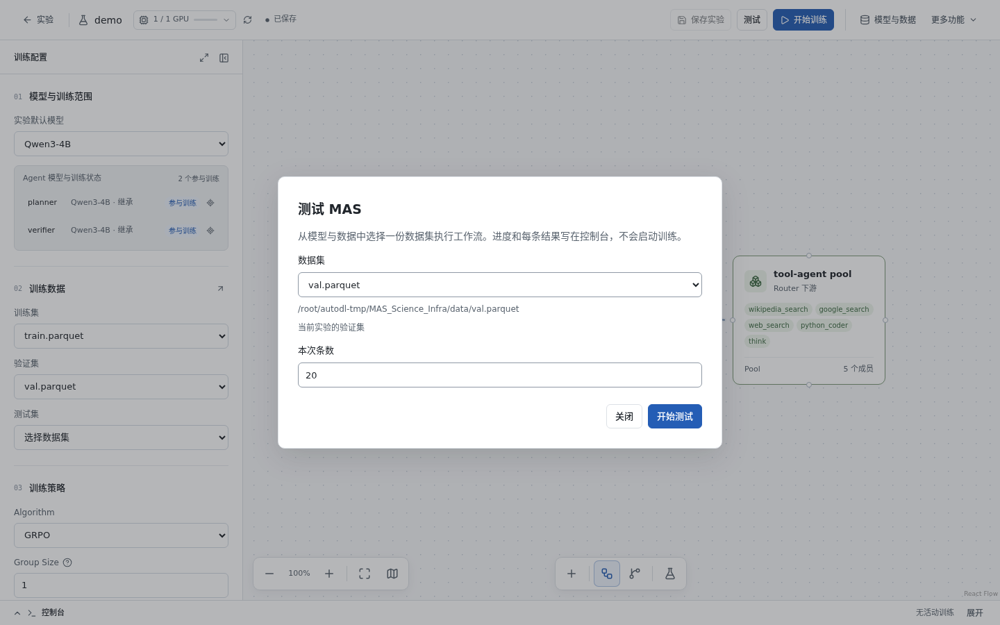

开始后进入和训练相同的控制台，但不会出现停止训练。日志里每一跳一行：`planner -> route_exec plan_step`、`wikipedia_search -> verifier tool_result` 这种形式。`tool_result` 带 `tier`。这次运行不调用训练接口。

点「开始测试」后才会检查模型是否能推理。上面这张图是对话框本身。截图时本机 8000 没有模型服务，所以没有进入测试控制台。

#### 3.4.4 采集不在画布按钮上

界面里没有 Collect 按钮。采集走命令行，产物仍是 `experiments/<id>/artifacts/collect.json`。

```bash
science-infra collect --mock --n 2 --out /tmp/traj.json
./run.sh live-api-data
```

中心化拓扑的 Collect 走编译后的 planner → router → pool → verifier。它不产生训练分支树。真 branch 只在训练 Daemon（`tir_algo` 为 arpo、aepo 或 rae）里出现。

从 parquet 抽题的字段仍是：`parquet` 默认 `data/val.parquet`，`data_n` 默认 5，`source` 默认 `gsm8k`。顶栏「测试」另选目录里已登记的数据集，不写这份 collect.json。

### 3.5 RL 页

**功能**：训练超参编辑 + 训练启停 + 日志 tail。

**基本字段**：

| 字段 | YAML | 说明 |
|------|------|------|
| algo | `rl.algo` | `grpo` / `arpo` / `aepo` / `appo` / `rae`（`/api/meta` 提供，即 `VALID_ALGOS`） |
| profile | `rl.profile` | `fast` / `a800` / `a800_2gpu` 资源档位 |
| 每题采样条数 | `rl.rollout_per_gpu` → `actor_rollout_ref.rollout.n` | GRPO 组大小 |
| 并行采集进程 | `rl.n_runners` | rollout runner 进程数 |
| model_path | `rl.model_path` | 训练模型权重（如 `LLM/Qwen3-4B`） |

占用卡数 = 顶栏已勾 GPU 数（保存时自动写 `trainer.n_gpus_per_node`）。

**高级 Hydra 字段**（「高级 Hydra 字段」按钮展开）：

| 字段（UI 标签） | YAML 路径 |
|---------------|----------|
| actor.optim.lr | `actor_rollout_ref.actor.optim.lr` |
| clip_ratio_low / high | `actor_rollout_ref.actor.clip_ratio_low/high` |
| entropy_coeff / kl_loss_coef | 同名 |
| train_batch_size | `data.train_batch_size` |
| rollout.n | `actor_rollout_ref.rollout.n` |
| gpu_memory_utilization | `actor_rollout_ref.rollout.gpu_memory_utilization` |
| n_gpus_per_node / total_epochs / experiment_name | `trainer.*` |

**操作按钮**：

- 「按当前机器推荐」：按 `GET /api/gpus` 的 `recommend` 档位预填（1 卡时 `a800_2gpu` 自动降为 `a800`/`fast`），需再保存
- 「保存超参」或「保存训练方案」：写 `rl.yaml`。顶栏「保存实验」会连同其它草稿一起落盘
- 「保存训练配置并确认启动」：先保存再训练（确认弹窗；会停本地 vLLM）。顶栏「开始训练」走同一条启动
- 「停止训练」：Stop
- 「打开 AGL Metrics」：训练中 LightningStore 存活时可点；否则显示「Metrics 未就绪」
- 「刷新日志」：重连当前 run 的 stdout SSE。切换 run 会清空上一份

### 3.6 Runs 与采样结果

**入口**：工作区菜单 **Runs**。一条训练记录上的「采样结果」打开 `#/experiments/<id>/runs/<runId>/samples`。训练控制台里也有同一入口。页面只读。

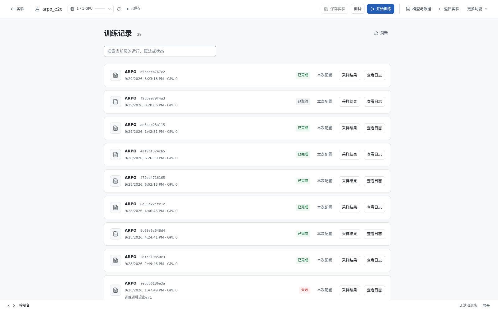

「本次配置」是这一次启动时的快照，凭据已脱敏，不是实验当前草稿。

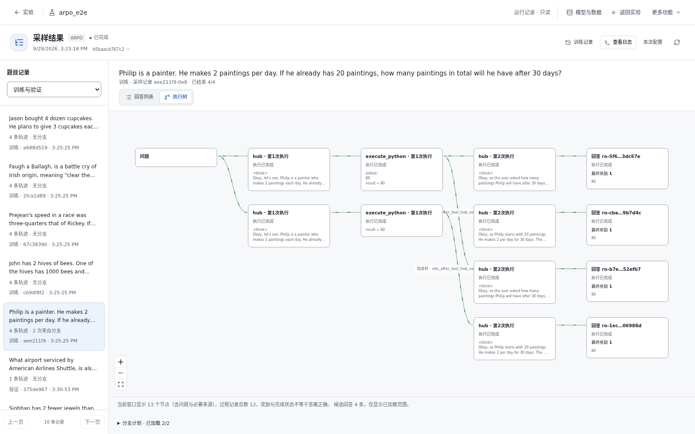

上图是 `arpo_e2e` 已完成 run `b5baacb767c2` 的执行树。节点名是 `hub` 和 `execute_python`，因为训练热路径仍是单 hub TirAgent；续写边对应那次记录里的 `after_tool` 站点。当前画布上的 planner / router 站点还没有新的训练树。

**功能**：可视化每条 query 的 rollout 树。

**数据源（2026-09-20 起）**：`GET /api/mas/rollout-trees` 双源合并——

1. **优先**：Daemon 训练期落盘的 `mas/.local_expansion/tree_<tree_id>.json`（`_persist_rollout_tree`，平铺格式）。child 节点 id 是**真实的 Store rollout id**，点进训练 rollout 日志能对上号。
2. 补充：runner 侧展开文件 `mas/.local_expansion/<rollout_id>.json`（同 `tree_id` 已被 daemon 树覆盖时**去重跳过**；无有效节点的退化树**过滤**，不再出现在列表里）。

- 树 chip 列表切换：每棵树按 `tree_id` 前 14 位展示；显示 `file / nodes / leaves / query` 概要。
- 节点标注：`node_id` + 关键 metrics（`event_kind`、`h_tool`、`site_id`、`reward_scheme`）+ `r=<reward>` + verdict。
- SSE 实时更新：`/api/events` 约每 0.5 秒从当前 train/collect 进程的 stdout 抽出 `{"__rollout_tree_event__"` 行，转发成 `rollout_tree`。排水不依赖总线上先有别的事件。训练写入新节点时，页面出现 `node_added`。

**心智模型**：root=query，叶子=outcome。Collect 产出为单链树（树和训练分支不是一回事）。真分支树在训练进行中就会出现：Daemon 每合入一棵新树就落盘 `tree_*.json`，采样结果页收到 `node_added`。不必等进程结束。离线复核：`.venv/bin/python scripts/rollout_tree_verify.py`。

### 3.7 Harness 页

**功能**：选择诊断插件并运行。

**可用插件**（`/api/meta` 的 `harness_plugins`）：

| 插件 | 状态 |
|------|------|
| log_error | 可用 |
| loss_volatility | 可用 |
| cognitive_convergence | 可用 |
| reward_hacking | 可用 |
| epc_aw_consensus | **stub**（复选框禁用） |

**操作**：

1. 勾选插件 → 「保存」（写 `harness.yaml` 的 `plugins`）
2. 「保存并诊断已有产物」：保存后对当前实验已有的 `collect.json` 跑 `POST /api/harness/diagnose`，表格列出 plugin / event_id / message（hypotheses）。这份产物由命令行 Collect 生成。

### 3.8 Monitor 页

**功能**：实验观测。曲线按实验聚合；日志按当前 run 订阅。

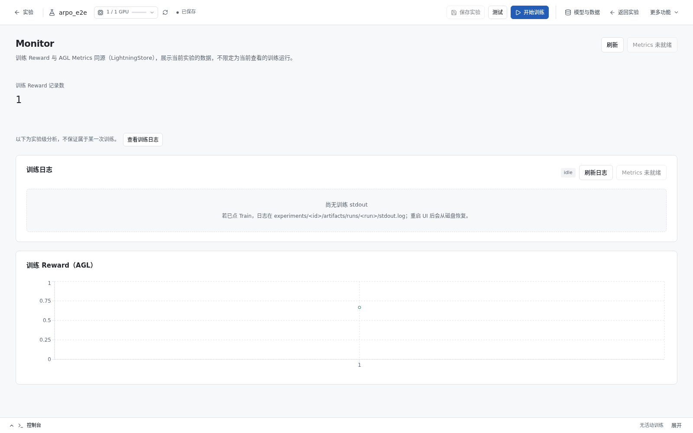

没有活动训练时，日志区是空的，曲线仍按实验保留。某一次 run 的 stdout 到「查看训练」或 Runs 的「查看日志」里看。

**统计 chip 行**：`collect n` / `collect mean` / `sampling mode` / `group_n` / `train pts` / `errors`。

**两套数据，不要混**：

| 区域 | 范围 | 数据从哪来 |
|------|------|------------|
| 训练 Reward、Collect Reward | 整个实验 | 训练中读 LightningStore；训练结束后回落 `mas/checkpoints/AgentLightning/<exp>/metrics.jsonl`。Collect 曲线来自该实验的 `artifacts/collect.json` |
| 训练日志 | 当前这一次 run | 该 run 的 SSE（`useRunLog`）。切换 run 会清空上一份再订阅新的。磁盘上仍是 `experiments/<id>/artifacts/runs/<run>/stdout.log` |

**卡片**：

1. **训练日志**：当前 run 的实时 stdout。刷新会重连这条 SSE。训练中可开 AGL Metrics。
2. **训练 Reward（AGL）**：实验级训练步曲线。无训练记录时为空。
3. **Collect Reward**：该实验 MAS 采集的 reward，不是训练步。
4. **Trajectories（按 group 分组）**：表列 group / idx / id / reward / branch / format / answer；点击行展开该轨迹完整 Events JSON。
5. **Harness**：hypotheses 表（可按 plugin 过滤）+ TrainSignal 摘要（advantage / loss 参数）。

---

## 4. 参数设置教程

### 4.1 UI 面板 → YAML → 生效代码 总表

| UI 位置 | 写入文件 | 生效字段/调用 |
|---------|---------|--------------|
| 顶栏 GPU | `rl.yaml` | `devices.ids` → `CUDA_VISIBLE_DEVICES`；`trainer.n_gpus_per_node` |
| 顶栏「保存实验」 | 五份 YAML | 工作区草稿落盘 |
| 顶栏「开始训练」 | — | `POST /api/rl/train` |
| Experiment 页 | `experiment.yaml` | `seed` / `name` |
| LLM 页 | `llm.yaml`（密钥进 `.secrets.env`） | Collector LLM；local 模式 vLLM start/stop |
| MAS 画布 + 小窗 | `workflow.yaml` | `agents/edges/entry_agent` + `sampling.{mode,group_n,beam_size,sites}` |
| MAS Inspector 训练简参 | `rl.yaml` | `rollout_per_gpu` / `n_runners` |
| RL 页 | `rl.yaml` | 全部超参；Train 时 overlay `algorithm.tir_algo` 等 |
| Harness 页 | `harness.yaml` | `plugins` → `HARNESS.diagnose` |
| Monitor | — | 实验级曲线 + 当前 run 的 stdout |
| Runs → 采样结果 | — | 只读 `mas/.local_expansion` |

保存动作永远是显式的（各页「保存」按钮）；切换页面不丢草稿但也不落盘。

### 4.2 三个易混旋钮辨析（勿混用「Rollout」一词）

| 说法 | 字段 | 在哪改 |
|------|------|-------|
| **采集入口**（Episode 从哪个 Agent 开始） | `workflow.entry_agent` | 画布拖「采集入口」pin 或 Inspector「设为采集入口」 |
| **可训练 Agent**（谁吃梯度） | `agents[].trainable` → `--active-agent` | 节点属性 Inspector 勾选 |
| **每题几条 / 并行进程** | `rl.rollout_per_gpu` / `rl.n_runners` | Inspector 训练简参或 RL 页 |

**不要**把 `rollout.n` 画成图节点。自检看三处：MAS 上采集入口 pin、Agent 节点是否「参与训练」、RL 设置里的每题条数和 GPU。

### 4.3 GPU / RL 旋钮

| 用户说法 | 字段 |
|---------|------|
| 选用哪些卡 | `rl.devices.ids` → `CUDA_VISIBLE_DEVICES` |
| 训练占几张卡 | `trainer.n_gpus_per_node = len(ids)`（保存时自动同步） |
| 每题采几条 | `rollout_per_gpu` → `actor_rollout_ref.rollout.n` |
| 并行采集进程 | `n_runners` |

`GET /api/gpus` 返回本机 GPU 列表与推荐档位。1 卡机器选 `a800_2gpu` 会自动降为 `a800`/`fast`。

### 4.4 采样语义：mode / group_n / initial_rollouts / beam_size

以 `group_n=4`（每题凑满 4 条）、`initial_rollouts=2`（第一波独立跑 2 条）、`tir_algo=arpo` 为例：

```text
Q ──┬── P1 ──[tool]── suffix_A          波1（独立）
    └── P2 ──[tool']── suffix_B         波1（独立）

从 P1 的 [tool] 拷贝前缀:
        ├── B1 ── suffix_C              波2 branch（共享前缀，只采后段）
        └── B2 ── suffix_D              波2 branch
```

`beam_size` 数值效果（分支条件成立时）：

| beam_size | 波1 | remaining | n_branch | n_global | 结果 |
|-----------|-----|-----------|----------|----------|------|
| 1 | 2 | 2 | 1 | 1 | 1 条前缀续写 + 1 条从头再开 |
| 2 | 2 | 2 | 2 | 0 | 2 条都从同一 tool 后前缀续写 |
| 8 | 2 | 2 | 2 | 0 | 被 remaining 卡住，仍 2 条 branch |

若 gate 不过（如 ΔH 不足）：`n_branch=0`，剩余名额全部 global 独立重开（仍凑满 group_n）。

mode 速查：

| mode | 行为 |
|------|------|
| `grpo_n` | 无树分支；每题独立跑 group_n 条，组内相对优势 |
| `arpo` | 两波：initial 独立 → 熵门控 branch + global 补齐；分支轨迹进 GRPO 组 |
| `aepo` | 类 ARPO 但波 1 仅 1 条探针；按熵预算分配 branch/global |
| `appo` | 经 overlay **映射为** arpo 通道（分支行 advantage 置零的独立实现尚未完成） |
| `rae` | RAE 裁决链；site `reward.scheme=rae_adjudicate`，组内 k≥k_min 才出 verdict |

深入阅读：[ROLLOUT_SAMPLING.md](./ROLLOUT_SAMPLING.md)（§5 beam 详解、§8 任务池模型）、[SAMPLING_ARPO_APPO.md](./SAMPLING_ARPO_APPO.md)（与官方实现对照）。

---

## 5. 典型例子：跑一次 ARPO 训练

以实验 `experiments/arpo_e2e/`（已预置 `sampling.mode=arpo`、`group_n=4`、`total_training_steps=3`）为例，从 UI 全程走通 ARPO。CLI 等价命令见 [ARPO_TRAIN_TEST.md](./ARPO_TRAIN_TEST.md)。

### 5.1 端到端路径图

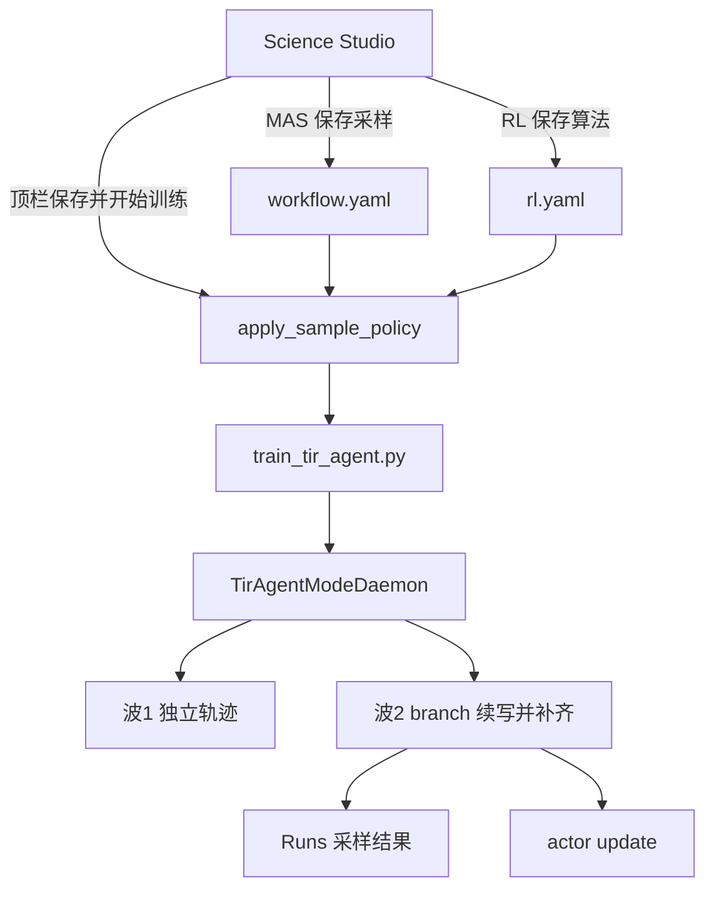

### 5.2 第一步：准备

```bash
nvidia-smi -L                                     # 确认 GPU
ls LLM/Qwen3-4B data/train.parquet data/val.parquet
# 缺数据时：
cd mas && TRAIN_LIMIT=32 VAL_LIMIT=8 bash scripts/prepare_data.sh
```

> 注意：当前仓库内 `data/{train,val}.parquet` 是 **5 行小样本**（为端到端快速验证而截断；2026-09-20 实测单 step ≈237s）。完整数据备份在 `data/*.full.parquet.bak`，恢复：`cp data/train.full.parquet.bak data/train.parquet && cp data/val.full.parquet.bak data/val.parquet`。小样本下 `experiments/arpo_e2e/rl.yaml` 的 `train_batch_size` 已同步调为 5。

`.env` 里配好 API（Collect live 用）：`OPENAI_API_KEY / OPENAI_API_BASE / OPENAI_MODEL`。

### 5.3 第二步：启动 UI 并选实验

```bash
./run.sh ui --daemon        # 后台；日志 artifacts/run_smoke/ui.log
```

浏览器打开 `http://127.0.0.1:8787/`。首页选实验 **`arpo_e2e`** 进入工作区。在 MAS 上确认入口是 planner，planner 可以勾「参与训练」。tool-agent 在 pool 里，不可训练。

### 5.4 第三步：LLM 页

- Collect 验证用：模式选 `api`，填 `model=qwen3.5-27b`、`base_url=https://www.dmxapi.cn/v1/`、API Key → 「探测连接」ok 后「保存 llm.yaml」。
- 训练本身用本地权重（RL 页 `model_path`），不受此页影响；**训练启动会自动停掉本地 vLLM**，无需手动处理 `local` 模式。

### 5.5 第四步：MAS 页声明分支采样

1. 采样设置：**mode=`arpo`**、**group_n=`4`**、**beam_size=`2`**。
2. 打开 planner 结束后的采样点（planner → router 这条边上，锚点 `after_agent_turn`），gate 用 **`entropy_delta`**。
3. 再打开 router 结束后的采样点，同样启用。不要按 tool 展开。
4. 顶栏「保存实验」。

当前画布保存后，`sampling.sites` 的 `agent_id` 是 planner 或 router 的 id，锚点是 `after_agent_turn`（verifier 则是 `after_verifier`）。

下面这段是 **2026-09-20** 当时写进 `experiments/arpo_e2e/workflow.yaml` 的记录，入口还是 hub，并展开了 tool 屏障。它对应后面的 run `384d1927458a`，不是现在的操作步骤：

```yaml
sampling:
  mode: arpo
  group_n: 4
  beam_size: 2
  sites:
  - id: site_after_tool_hub_execute_python
    enabled: true
    anchor: { kind: after_tool, agent_id: hub, tool_id: execute_python }
    gate: { type: entropy_delta }
    fork: { beam_size: 2, resume_mode: messages }
  - id: site_after_turn_hub
    enabled: true
    anchor: { kind: after_agent_turn, agent_id: hub }
    gate: { type: entropy_delta }
```

### 5.6 第五步：RL 页设训练参数

1. **algo=`arpo`**（下拉）。
2. **每题采样条数=`4`**（= group_n，overlay 会同步 `actor_rollout_ref.rollout.n=4`）。
3. **n_runners=`1`**；profile=`fast`（单卡）。
4. model_path 确认为 `LLM/Qwen3-4B`（绝对路径）。
5. 可选：「按当前机器推荐」预填档位；「高级 Hydra 字段」里 `total_epochs=1`、`experiment_name` 等（`total_training_steps=3` 在 rl.yaml 中，短训验收够用）。
6. 「保存超参」。

### 5.7 第六步：（可选）先用命令行采集冒烟

界面没有 Collect 按钮。保存实验后：

```bash
science-infra collect --mock --n 2 --out /tmp/traj.json
```

预期：轨迹里能看到工具调用和答案；`experiments/arpo_e2e/artifacts/collect.json` 可以随后由诊断或 Monitor 读取；**没有** expansion / `branch_local_count`。中心化 Collect 走 planner → router → pool → verifier，不做训练分支。

想验真实链路再用 `./run.sh live-api-data`（默认 `data/val.parquet`，gsm8k）。

### 5.8 第七步：保存并开始训练

1. 顶栏 GPU 勾选训练用卡（如 `GPU 0`）。
2. 点「保存实验」，再点「开始训练」。确认弹窗会说明将停止本地 LLM。
3. 按钮变成「查看训练」。点进去看当前 run 的 stdout。Runs 里点「采样结果」看树。Monitor 的曲线是实验级的，日志区只显示这一次 run。

训练启动时后端会：写回 `rl.yaml` 前调用 `apply_sample_policy(workflow.sampling)`，同步 `algo` / `rollout.n` / `algorithm.tir.*`（`tir_algo=arpo`），再以 `CUDA_VISIBLE_DEVICES=<勾选卡>` 拉起 `train_tir_agent.py --rl-yaml .../arpo_e2e/rl.yaml`。当前训练热路径是单 hub TirAgent 加声明式分支采样，不会把画布上的多专家拓扑原样执行。

### 5.9 第八步：验收（对照 [ARPO_TRAIN_TEST.md](./ARPO_TRAIN_TEST.md) Phase 4）

| 判据 | 期望 | 在哪看 |
|------|------|-------|
| 启动日志 | `tir_algo=arpo`（`adv_estimator` 仍为 `grpo`，正常） | 查看训练 / Monitor 当前 run 日志 |
| sibling sampling | `Applied sibling workflow.sampling → tir_algo=arpo rollout.n=4` | 同上 |
| 波 1 | 每题约 `initial_rollouts=2` 条独立轨迹 | 同上 |
| 波 2（branch） | enqueue 元数据出现 `resume_messages` / `arpo_branch` / `tir_branch`；`training/incremental_branch_count` 增长 | 日志 / metrics |
| **branch 真的触发** | metrics 行出现 `training/branch_local_count` > 0，且日志出现 `[TIR arpo] enqueued <N> branch/resume rollouts` | 当前 run 日志 |
| **采样结果可见** | `mas/.local_expansion/tree_ro-*.json` 出现（child 为真实 store rollout id），Runs → 采样结果里可以点开 | 文件 / 采样结果 |
| expansion 产物 | `mas/.local_expansion/<rollout_id>.json` 含 `plans[]`、`branch_local_count>0` | 文件 / 采样结果 |
| 组大小 | 同 `data_id` 凑近 `rollout.n=4` | Monitor Trajectories 按 group 分组 |
| 步进 | AGL metrics / TensorBoard ≥ 3 steps | 横幅「AGL Metrics」 |
| 磁盘 overlay | `rl.yaml` 的 `algorithm.tir_algo=arpo` 且 `rollout.n=4` | 文件 |

一句话验收：日志出现 `tir_algo=arpo`，同题先跑 2 条独立轨迹，再出现带 `resume_messages` 的第二波，且 metrics 写出 ≥ 3 个 training step。

**2026-09-20 实测（5 样本小数据集，run `384d1927458a`）**：`branch_local_count=6`、`store_enqueue=6`、`incremental_branch_count=6`；日志 `[TIR arpo] enqueued 4 branch/resume rollouts`；`mas/.local_expansion/tree_ro-*.json` 共 6 棵（`after_tool`×2 + `after_agent_turn`×4）；单 training step ≈237s（batch=20 时为 2704s）。

**关键日志（2026-09-19 起）**：启动日志应出现 `Adapter agent match: 'agent' (MAS agent 'hub' -> langgraph node)`——这确认 span→triplet 命名空间映射已生效；随后 metrics 应出现 `training/n_triplets` 非零（如 43）。若看到 `Length of triplets is 0` 连续告警并最终 `IndexError: argmax() Expected reduction dim 0 to have non-zero size`，说明 triplet 提取被 agent_match 过滤为空（旧版本 bug，已修复）。

### 5.10 第九步：停止与产物

- 停止：训练控制台里的 Stop（`POST /api/rl/stop`）。
- 产物路径：

| 产物 | 路径 |
|------|------|
| 训练 stdout | `experiments/arpo_e2e/artifacts/runs/<run>/stdout.log`（Control 重启后仍可恢复） |
| overlay 后 rl.yaml | `experiments/arpo_e2e/rl.yaml` |
| expansion plans | `mas/.local_expansion/<rollout_id>.json`（runner 展开，合成 `{parent}:0` 节点 id） |
| **采样树** | `mas/.local_expansion/tree_<tree_id>.json`（Daemon 落盘，真实 store rollout id） |
| **训练 reward 历史** | `mas/checkpoints/AgentLightning/<exp>/metrics.jsonl`（Monitor 实验级曲线的离线源） |
| collect 产物 | `experiments/arpo_e2e/artifacts/collect.json` |
| 训练曲线 | 训练中的 AGL Metrics；结束后看 Monitor 的实验级曲线 |

### 5.11 假绿警告（务必读）

| 假绿 | 真相 |
|------|------|
| Collect 成功（`collect.json` 绿） | **不做**树分支；真 branch 只在 Train Daemon（`tir_algo∈{arpo,aepo,rae}` + `expand_in_runner`） |
| UI 勾了 `on_token` | runtime 默认 `after_tool`，不发 `ON_TOKEN` 事件 |
| `token_prefix` 已选 | 训练侧恒降级 messages（`resume_mode_downgraded`） |
| `tir.ready_batch_size=0` | 训练默认路径常为 0；以 Daemon **增量 enqueue** + 单测为准 |
| 负例：`beam_size=1` 或极大 gate 阈值 | 仍应凑满 group_n（global fill），`n_plans` 可为 0 |
| GPU 显得空闲（训练中） | 训练进程若崩溃，内嵌 vLLM 随之退出。先看「查看训练」或 Monitor 当前 run 日志尾部是否 `IndexError` |

自动化复核：

```bash
./run.sh branch-ui-test              # 验 sites + Collect wiring
./run.sh branch-ui-test --train      # 再短训扫 expansion / rl.yaml
./run.sh arpo-train-test             # 10 轮采样/reward/loss 断言
.venv/bin/python scripts/rollout_tree_verify.py   # RolloutTree 落盘/契约/API 验收（B1-B5；2026-09-20 起 5/5 PASS）
.venv/bin/python -m unittest \
  mas.tests.test_gates_and_rae \
  mas.tests.test_phase_abcd_rae_activeset \
  mas.tests.test_branch_policy_activeset -v   # 单测兜底
```

**参数矩阵回归（2026-09-19 新增，全部 PASS）**：采样小窗的参数持久化可经 Control API 批量验证——8 种 gate 类型 ×1、5 种 anchor × 3 种 when（`first`/`nth`/`all`）=15 组、fork 参数（beam_size 1–3 / share_observation / resume_mode / probe_max_tokens）4 组、reward scheme（`scalar_grpo`/`rae_adjudicate`/`pairwise`/`pairwise_plus`）4 组、sampling 顶层（5 种 mode + group_n/beam_size/initial_rollouts/max_total_rollouts/branch_prob）10 组、RL 参数（profile×3、algo×4、n_runners、trainer/algorithm/data 子块）19 组。分支判定运行时逻辑（熵增触发、consecutive_high 惩罚、ARPO fork 概率、allocate_forks 预算、distribute_root_budgets、AEPO 全局预算）另有纯函数单测覆盖。

---

## 6. 常见问题 FAQ

**Q1：AGL Metrics 按钮为什么是灰的？**
LightningStore（默认 `:4747`）只在 `agl.Trainer.fit()` 期间存在，Control UI 自己不起 AGL。无训练或训练已结束时按钮禁用并显示「Metrics 未就绪」；训练 running 且探活成功后自动可点（同源 `/agl/metrics`）。**不要**手动访问 `127.0.0.1:4747`（AutoDL 上那可能是你的笔记本）。可用环境变量 `AGL_METRICS_ORIGIN` 改 origin。

**Q2：改了代码 / 更新了 palette，UI 下拉里没有新选项（如 `rae`）？**
必须重启 UI：`./run.sh ui --stop && ./run.sh ui --daemon`。前端 dist 与后端 palette 都在启动时加载。

**Q3：保存后画布提示不可执行，或采集返回 400？**
图不可执行（`executable=false`）。常见原因：Agent↔Agent 连了 `tool_call`、`route` 目标有多条入边、`message` 连到 Tool 节点。画布上的 chip 会显示具体原因。采集不在顶栏，修正边并保存后，用 `science-infra collect --mock` 再跑。

**Q4：采集成功但采样结果里没有分支树？**
Collect 不做训练分支（`beam_size` 只是声明）。真 branch 只在训练（`tir_algo` 为 arpo、aepo 或 rae）时由 Daemon 产生，产物在 `mas/.local_expansion/`。到 Runs 点「采样结果」查看。`./run.sh branch-ui-test --train` 也能生成。

**Q5：训练启动后本地 vLLM 被停了？**
设计行为：Train 与本地 LLM 互斥（抢 GPU）。启动训练的确认弹窗有提示；训练结束后在 LLM 页重新「一键启动 LLM」。

**Q6：Monitor 的 Collect 曲线和训练 Reward 有什么区别？**
两条都是实验级曲线。Collect 曲线来自该实验的 `artifacts/collect.json`；训练 Reward 与 AGL Metrics 同源，训练中读 LightningStore，结束后回落 `metrics.jsonl`。它们都不是「当前 run 的 stdout」。当前 run 的日志在训练日志卡片里，切换 run 会清空上一份。

**Q7：`rollout_per_gpu` 和小窗 `group_n` 不一致会怎样？**
Train 时后端用 `apply_sample_policy(workflow.sampling)` 覆盖：`group_n → rollout.n`。以小窗为准，建议两边保持一致（ARPO 例中都是 4）。

**Q8：想换算法跑 RAE？**
小窗 mode=`rae`，选中的 site reward 改 `rae_adjudicate`（组内 k≥k_min 才出 verdict，不足允许 abstain）；RL 页 algo=`rae`。复核命令：`./run.sh branch-ui-test --algo rae --train`。

**Q9：如何不训练只验证控制面？**
```bash
./run.sh ui-test --no-train   # GPU/RL API smoke（start 后立刻 stop）
./run.sh branch-ui-test       # sites + Collect wiring
```

**Q10：测试入口一览？**
```bash
./run.sh feature-test --list   # 功能域以这份列表为准
./run.sh feature-test functional
./run.sh feature-test branch
./run.sh traj-test
./run.sh arpo-train-test
```
`functional` 域 19 例已通过。全量数字不要写成历史的「15 域 154 例」。

**Q11：训练日志里 `Length of triplets is 0` 反复出现然后崩溃（`IndexError: argmax()`），GPU 也空了？**
旧版本 bug（2026-09-19 已修复）：span→triplet 的 `agent_match` 误用 MAS 图 agent 名（`hub`），而 AGL adapter 读的是 LangGraph 节点名（`agent`/`tools`/...），命名空间不匹配导致所有 LLM span 被过滤、训练 batch 为空。修复后训练入口会打印 `Adapter agent match: 'agent' (MAS agent 'hub' -> langgraph node)`。GPU 空白 = 训练进程已崩溃退出（vLLM 内嵌在训练进程里），与「没启动本地 LLM」无关——LLM 页的一键启动只服务 Collect(live)。

**Q12：外部能 curl 到树，采样结果页却一直转圈或请求挂起？**
多半是浏览器连接配额。`/api/events` 是一条不结束的 SSE；HTTP/1.1 下每个域名大约 6 条并发连接，IDE 内嵌 webview 很容易把后续 `fetch` 堵住。改用外部浏览器（经 §1.4 的公网转发或 SSH 端口转发访问 8787）。API 可用 `curl http://127.0.0.1:8787/api/mas/rollout-trees` 直接验证。树帧由 `/api/events` 约每 0.5 秒从 stdout 排水转发，不依赖总线上先有别的事件。

**Q13：训练结束后 Monitor 的训练 Reward 曲线消失了？**
旧行为（LightningStore 随训练进程退出而关闭，曲线清空）。**已修复（2026-09-20）**：`services._offline_step_rewards` 离线回落读取 `mas/checkpoints/AgentLightning/<exp>/metrics.jsonl`，训练结束后曲线保留（历史 step 序列，index 单调）。需要**重启 UI**（`./run.sh ui --stop && ./run.sh ui --daemon`）加载新后端代码后生效。


