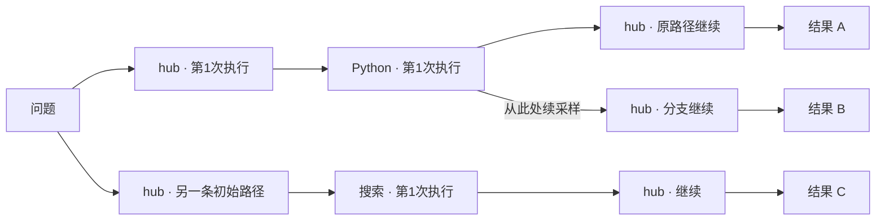

# Plan

**一棵 RolloutTree 展示同一道题在一次采样组中的所有执行路径。普通节点是某个 Agent 的一次实际执行；每条 initial rollout 从题目开始横向展开，分支从对应执行节点后的恢复位置接出，直到各自结束。**

本轮只解决三件事：把节点定义正确、把每次执行的内容记录下来、把真实分支画清楚。沿用 [原第三阶段](RolloutTree第三阶段-树视图与持续更新.md) 的文档格式，不修改训练算法。2026-09-28：前四阶段代码与核心检查已接入，第五阶段的真实服务器训练和浏览器验收待完成，详见各阶段记录。

## Position in the Project

[new_framework 设计](../../docs/New_framework_design.md) §1.3–1.4 的主线是“Agent 工作窗口、query 为根、完整采样路径、最终结果”。旧 §2.4 又用 rollout ID 表示普通节点，造成了整条回答和一次 Agent 执行混淆。本轮明确改为：

| 概念 | 在树中表示什么 |
| --- | --- |
| 问题 | 左侧唯一根节点 |
| Agent 的一次执行 | 过程节点；同一个 Agent 执行三次，就是三个不同节点 |
| initial rollout | 从问题开始的一条独立路径，不是一张节点卡片 |
| branch rollout | 复用已有前缀、从分支位置开始的新后缀 |
| 最终结果 | 路径右端的结束节点，显示答案、状态和最终奖励 |
| Window / Snapshot | 分支位置和恢复数据，保留在节点/连线信息中，不再默认画一张技术卡片 |

Workflow 是 Agent 定义图；RolloutTree 是这些 Agent **实际运行过的过程图**。当前 hub ReAct 中，一次 `call_model` 算一次 hub 执行，一次工具调用算一次 Tool/Tool-agent 执行。HTTP 重试放进该节点详情，不把网络重试当作新的采样分支。

## Proposed Architecture

### 用户应当看到的树



第一条 initial rollout 原本沿 A1、A2、A3 到结果 A。分支使用 A2 完成后的真实快照，沿 A1、A2、B1 到结果 B；A1/A2 只画一次，A3 不属于分支路径。第二条 initial rollout 独立展开，不因使用相同 Agent 或得到相同答案而合并。

正常顺序路径从左到右排列；不同初始路径上下分行。分支保留原路径水平向右，新路径从准确位置向下展开。若真的并行调用工具，在同一列作局部分组并汇合，不能伪造串行顺序，也不能把工具并行标成采样分支。

### 节点到底记录什么

过程节点保存：Agent 名称、该次执行 ID、所属 rollout/attempt、执行状态，以及内容引用。点击后阅读本次实际输入、模型返回的推理和普通输出、工具参数/结果、错误与已有指标。

- 模型返回 reasoning 时保留；没有独立 reasoning 时展示原始输出，不补写思考。
- 只提取最终答案不足以交付节点过程；输入输出必须在真实调用处记录。
- 纯函数工具展示参数和结果，不伪装成有模型思考。
- 最终奖励放在结果节点，不自动复制成沿途每个 Agent 的贡献。

### 只扩展一套树结构

继续使用 `RolloutTree`，新记录写 v3：`nodes` 保存执行节点，`edges` 保存执行/分支连接，rollout 信息保存路径归属和结果引用。长内容留在 Archive，树只保存摘要和引用。

**不再单独建设 ExecutionGraph 产品、双份图投影、采样审计服务或新的事件回放系统。** 旧 v2 记录按旧结构只读展示回答来源，新 v3 记录展示执行树；不强制转换旧记录，也不为新 run 同时维护两份树。

```text
实际 Agent/Tool 调用
  → 复用 Archive 记录节点内容
  → 现有 Daemon/Recorder 合并节点、分支和结果
  → 按 run 保存 RolloutTree
  → 现有只读 API
  → 横向执行树 + 节点详情
```

### 分支规则只做必要展示

没有分支不是本轮需要单独建设的分析功能。到达配置的分支点时，在该节点详情保留**已有门控的一次评估结果**即可，不新增原因分类体系、统计面板和决策查询接口。

需要保留一个事实区别：没走到分支点，不等于已经评估却没过阈值。当前官方 ARPO 门控还包含随机性；不重跑门控来解释结果。缺快照、入队失败等真正异常沿用日志与节点错误提示，不归为正常未通过。

## Scope

- In：节点数据结构、实际过程记录、共享前缀连接、节点内容读取、横向树布局和稳定更新。
- In：当前已支持的 ARPO 工具返回分支；其他节点可以展示，但不因此新增分支能力。
- Out：独立采样审计、全量失败原因报表、并排路径对比工具、通用 Trace 平台、图数据库、逐 token 推送。
- Out：改变训练参数、增加新的窗口恢复方式、计算新的节点 credit、把旧日志推测成完整过程。

## Implementation Sequence

| 阶段 | 做什么 | 交付标准 |
| --- | --- | --- |
| [第一阶段：节点与数据结构](RolloutTree执行树第一阶段-节点与数据结构.md) | 明确节点、连线、rollout 归属及分支引用 | 能表达两条初始路径和其中一次真实分支 |
| [第二阶段：执行过程记录](RolloutTree执行树第二阶段-执行过程记录.md) | 记录每次 Agent/Tool 的实际输入输出 | 点任意已记录过程节点都能读取其真实内容 |
| [第三阶段：树组装与结果读取](RolloutTree执行树第三阶段-树组装与结果读取.md) | 接通节点顺序、共享前缀、归档和接口 | 分支不复制前缀、不接到父最终答案后面 |
| [第四阶段：横向树与节点详情](RolloutTree执行树第四阶段-横向树与节点详情.md) | 一题所有采样从左到右展示 | 初始路径、分支位置、执行内容和各自结果一目了然 |
| [第五阶段：持续更新与运行验收](RolloutTree执行树第五阶段-持续更新与运行验收.md) | 复用轮询，完成真实运行与重读检查 | 运行中能更新，运行后还能读，训练行为不被改变 |

## Action Items

- [x] 先完成节点定义，再接入过程记录，不从现有回答卡片反推 Agent 节点。
- [x] 复用当前采样、Archive、Recorder、API 和 React Flow，只增加必要字段与组件。
- [ ] 核心快速检查已完成；真实服务器和 UI 联调待完成。

## Acceptance and Delivery Boundary

验收的核心是：**一题、多条初始路径、准确的分叉位置、每个执行节点的可读过程、各条路径的最终结果。** 没有实际分支时展示真实直线，不制造连线；有分支时公共前缀只出现一次。

同题跨训练步、训练/验证或不同 run 仍保持各自采样组，不因题目文字相同合并。旧记录继续可读，但不能宣称已有逐节点过程。

## Next Phase

服务器验收见 [第五阶段：持续更新与运行验收](RolloutTree执行树第五阶段-持续更新与运行验收.md)。部署后新建的训练 run 默认写 v3，旧 v2 记录不自动补造执行过程；建议先确认逐节点内容，再确认真实分支和共享前缀。
